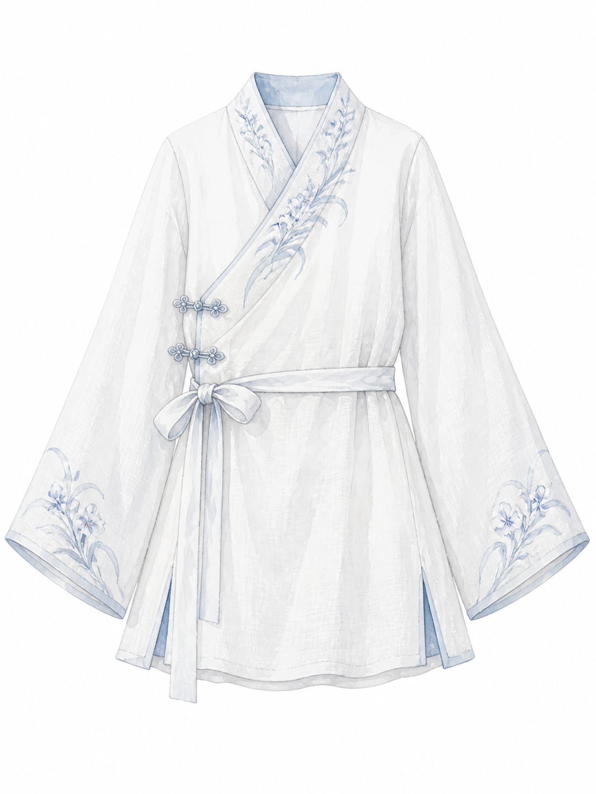
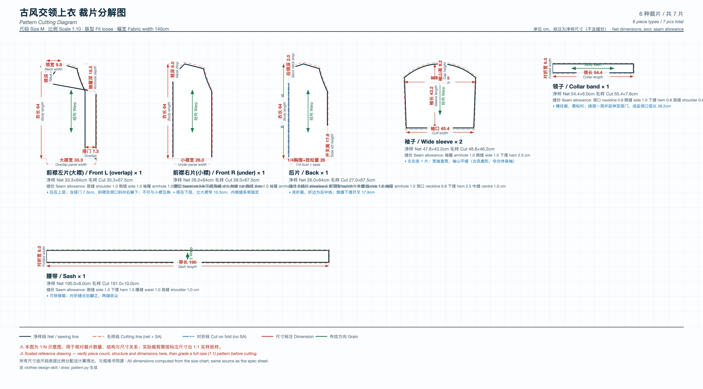
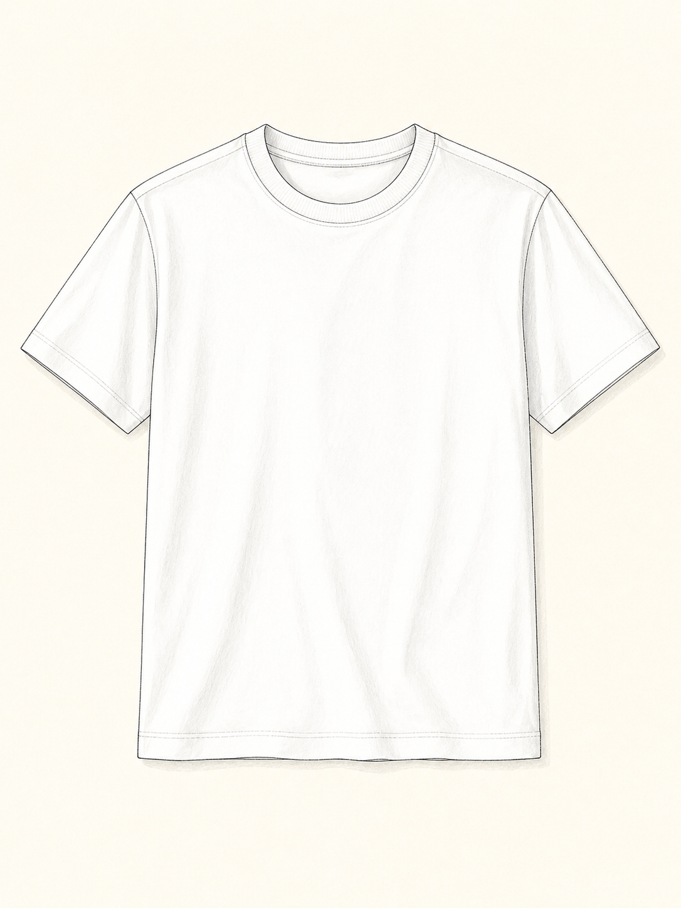
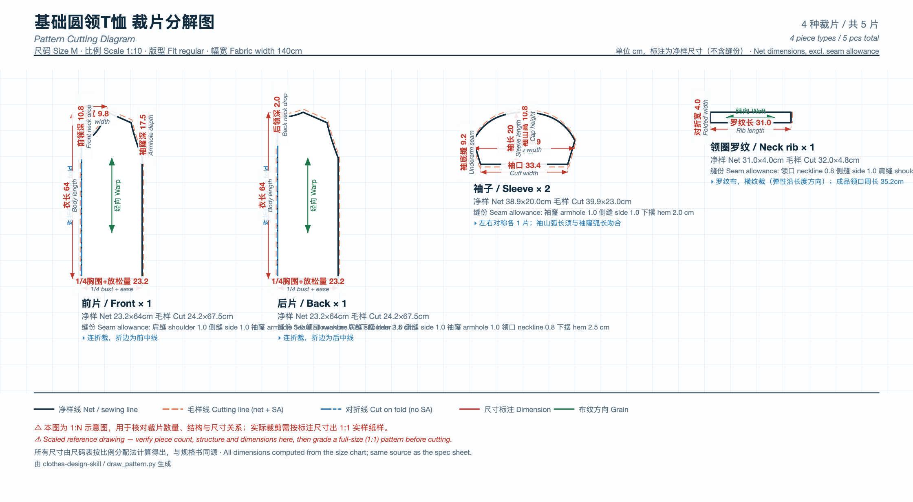
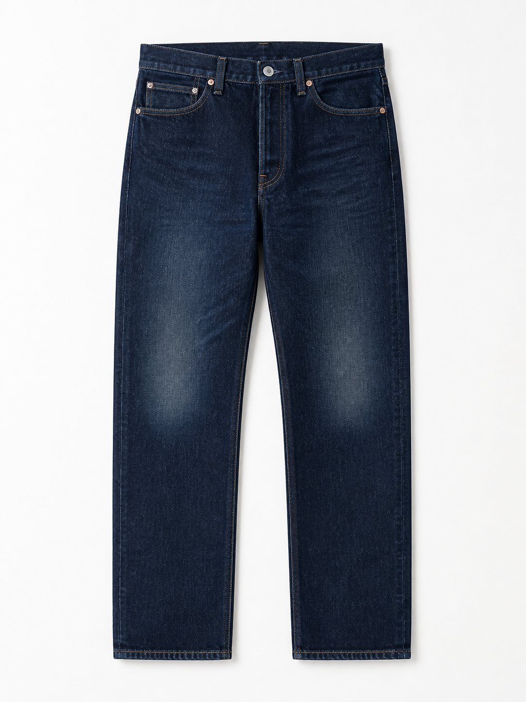
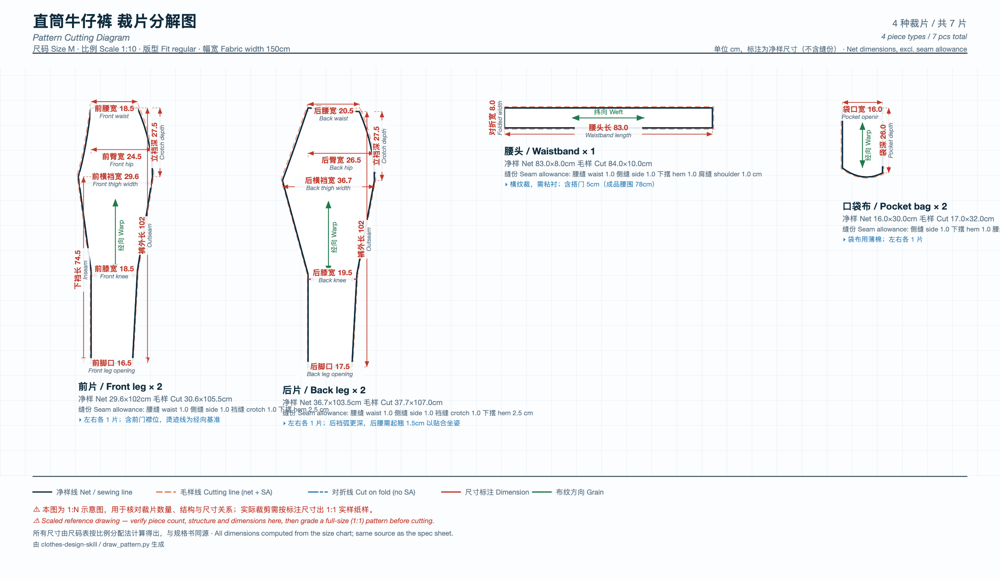
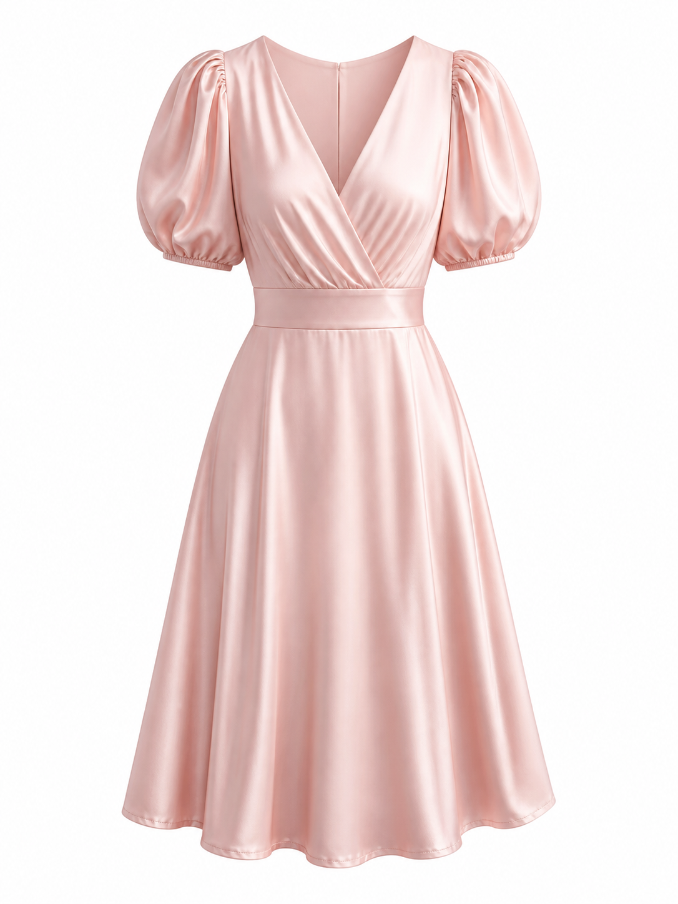
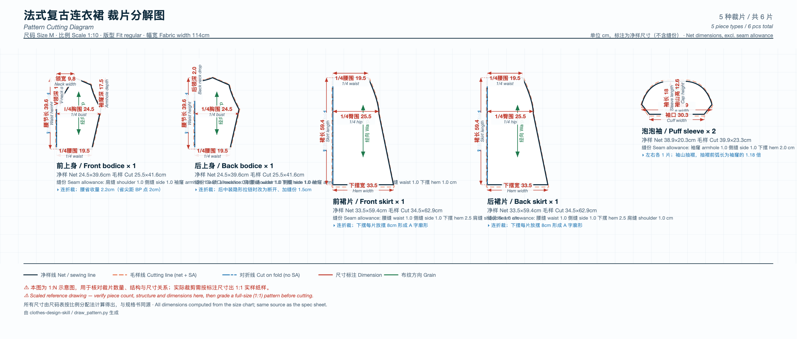

# 服装设计示例

本目录包含 clothes-design-skill 的实际输出示例，展示从需求到规格书的完整流程。

## 示例 1：古风交领上衣

**款式：** 古风交领上衣（blouse）  
**面料：** 亚麻（linen）  
**尺码：** M, L, XL

### 输出文件

- `01-gufeng-blouse-sample.png` - 样衣效果图（水彩风格，3:4）
- `01-gufeng-blouse-pattern.svg` - 裁片分解图（**计算生成的矢量技术图**，6 种裁片/7 片）
- `01-gufeng-blouse-spec.md` - 设计规格书

**预览：**




> 交领结构：大襟 31.8cm 宽 vs 小襟 24.5cm 宽——两片**不对称**，裁成一样宽交领就交不上。

**规格摘要：**
- 尺码表：M/L/XL 三档
- 面料用量：2.74米（M码参考）
- 成本：¥260.59（面料¥109.60 + 辅料¥12 + 人工¥105 + 管理费¥33.99）

---

## 示例 2：基础圆领T恤

**款式：** T恤（t-shirt）  
**面料：** 纯棉（cotton）  
**尺码：** 全尺码（XS-XXXL）

### 输出文件

- `03-tshirt-sample.png` - 样衣效果图（手绘风格，3:4）
- `03-tshirt-pattern.svg` - 裁片分解图（**计算生成的矢量技术图**，4 种裁片/5 片）
- `03-tshirt-spec.md` - 设计规格书

**预览：**




**规格摘要：**
- 尺码表：XS/S/M/L/XL/XXL/XXXL 七档
- 面料用量：2.55米（M码参考）
- 成本：¥165.31（面料¥63.75 + 辅料¥5 + 人工¥75 + 管理费¥21.56）

---

## 示例 3：直筒牛仔裤

**款式：** 牛仔裤（pants）  
**面料：** 牛仔布（denim）  
**尺码：** 全尺码（XS-XXXL）

### 输出文件

- `04-jeans-sample.png` - 样衣效果图（摄影风格，3:4）
- `04-jeans-pattern.svg` - 裁片分解图（**计算生成的矢量技术图**，4 种裁片/7 片）
- `04-jeans-spec.md` - 设计规格书

**预览：**




**规格摘要：**
- 尺码表：XS/S/M/L/XL/XXL/XXXL 七档
- 面料用量：2.42米（M码参考）
- 成本：¥273.35（面料¥84.70 + 辅料¥18 + 人工¥135 + 管理费¥35.65）

---

## 示例 4：法式复古连衣裙

**款式：** 连衣裙（dress）  
**面料：** 真丝（silk）  
**尺码：** 全尺码（XS-XXXL）

### 输出文件

- `05-dress-sample.png` - 样衣效果图（3D渲染风格，3:4）
- `05-dress-pattern.svg` - 裁片分解图（**计算生成的矢量技术图**，5 种裁片/6 片）
- `05-dress-spec.md` - 设计规格书

**预览：**




**规格摘要：**
- 尺码表：XS/S/M/L/XL/XXL/XXXL 七档
- 面料用量：3.61米（M码参考）
- 成本：¥693.68（面料¥433.20 + 辅料¥20 + 人工¥150 + 管理费¥90.48）

---

## 生成这些示例的命令

每个示例都是三件套：**效果图（3:4）+ 裁片图（16:9）+ 规格书（markdown）**。
以古风上衣为例，其余款式换掉 prompt 内容和 `--type/--category/--fabric` 即可。

```bash
# 1. 效果图（款式风格自选：手绘/水彩/3D/摄影）
node scripts/generate-image.js \
  --prompt-file /tmp/gufeng-sample-prompt.md \
  --output examples/01-gufeng-blouse-sample.png \
  --aspect-ratio 3:4

# 2. 裁片图（计算生成，不用 AI 生图）
python3 scripts/draw_pattern.py \
  --type crossover-blouse --size M --fit loose \
  --fabric-width 140 --title "古风交领上衣" \
  --output examples/01-gufeng-blouse-pattern.svg

# SVG 转 PNG（保持比例）
bash scripts/svg2png.sh examples/01-gufeng-blouse-pattern.svg

# 3. 规格书（尺码表 + 面料用量 + 成本明细）
python3 scripts/calculate_garment.py \
  --type blouse --category tops --fabric linen \
  --sizes M L XL \
  --output examples/01-gufeng-blouse-spec.md
```

---

## 为什么裁片图不是 AI 生成的

早期版本用生图模型画裁片图，结果不可用——扩散模型渲染数字不可靠，更要命的是它标的数字与尺码表**没有任何计算关系**，纯粹是"看起来像尺寸标注的装饰"。打版师照着一个凭空生成的"袖长 20"下剪就是废料。

现在裁片图由 `scripts/pattern_drafting.py` 按比例分配法从尺码表算出几何，再由 `scripts/draw_pattern.py` 渲染成 SVG。每处标注都能追溯回尺码表，且出图前会自动校验"标注数字"与"所指线段实际长度"是否一致，不一致就拒绝出图。

被替换掉的 AI 版本留在 `deprecated-ai-patterns/` 供对比。

---

**说明：**
- **效果图**为 PNG（1086×1448，3:4），AI 生成，用于视觉表达
- **裁片图**为 SVG 矢量图，计算生成；同名 `.png` 由 `scripts/svg2png.sh` 按原始比例光栅化，仅用于内嵌预览，**交付请用 `.svg`**
- 规格书为 Markdown，包含尺码表、面料用量、成本明细
- 成本按 2026 年市场均价估算，实际采购价受批量、地域影响
- **裁片图尺寸准确，但仍是 1:N 示意图，不是可裁剪纸样。** 曲线为贝塞尔近似、省道未展开、袖山弧长未实测，
  落地必须由打版师出 1:1 实样。完整局限见 `references/pattern-engineering.md`。
