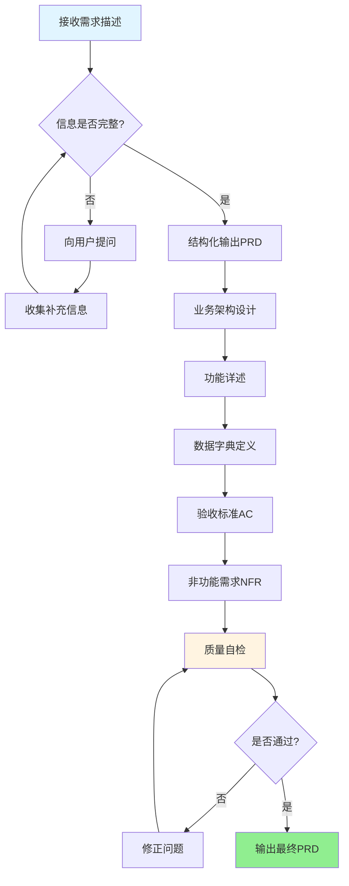
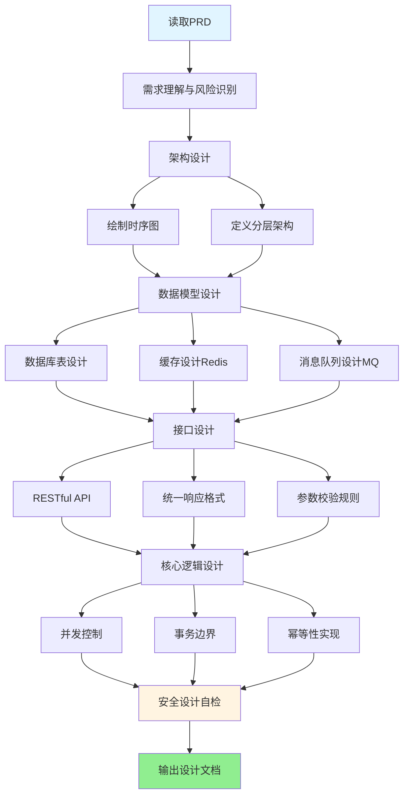
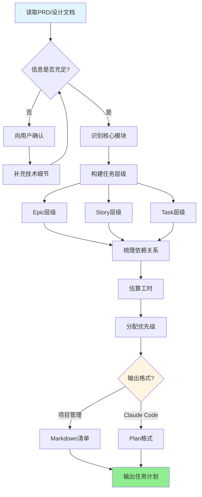
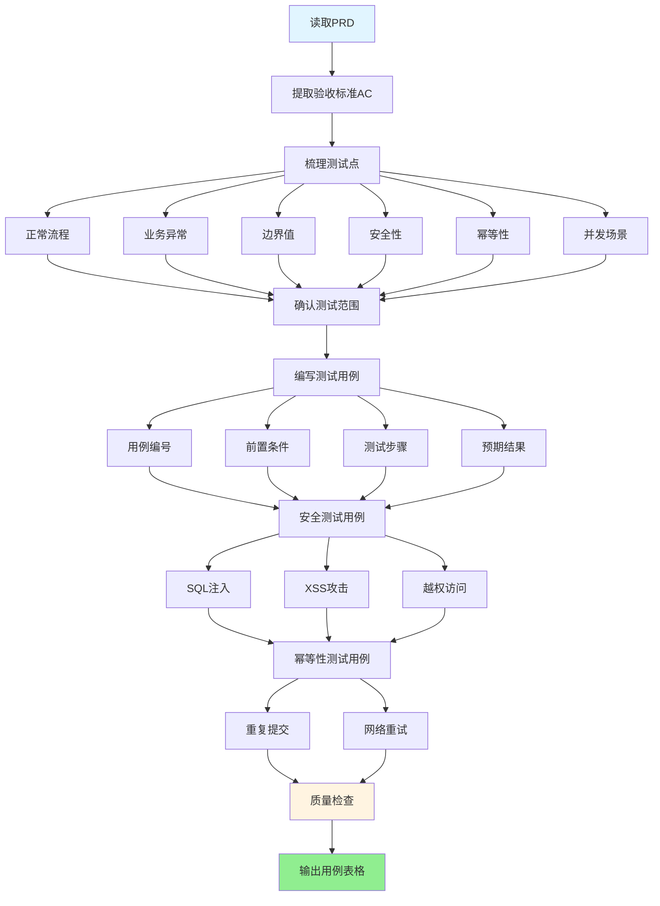
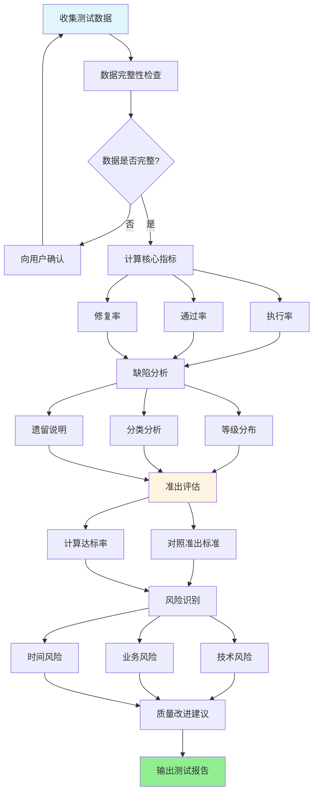

# 企业级产品应用开发全流程技能包

<div align="center">

[](https://github.com/JianJang2017/jianjang-skills/tree/master/enterprise-dev-flow)
[](LICENSE)
[](https://claude.ai/code)
[](https://spring.io/projects/spring-cloud-alibaba)

[English](README_EN.md) | 简体中文

</div>

---

## 📖 简介

企业级产品应用开发全流程技能包是一套专为 **Claude Code** 设计的智能开发助手工具集，覆盖从需求分析到测试验收的完整软件开发生命周期。

通过 5 个核心技能、25+ 规则文件和 6 个参考模板，帮助团队：
- ✅ 规范化需求文档（PRD）撰写
- ✅ 标准化技术设计方案输出
- ✅ 自动化任务拆分与计划生成
- ✅ 系统化测试用例设计
- ✅ 专业化测试报告产出

**适用技术栈：** Spring Cloud Alibaba + PostgreSQL + Redis + RocketMQ + MinIO

---

## ✨ 核心特性

### 🎯 全流程覆盖
从产品需求到测试验收，每个环节都有对应的专业技能支持，确保文档规范的一致性。

### 📚 规则模块化
25+ 细分规则文件（安全、数据库、API、代码质量、Git、测试、架构），统一维护，按需引用。

### 🔍 自动质量检查
每个技能内置质量检查清单，输出前自动验证是否符合企业级规范。

### 🚀 双格式输出
任务拆分技能同时输出项目管理清单（Markdown）和 Claude Code Plan，满足不同场景需求。

### 🛠️ 技术栈适配
专门针对 Spring Cloud Alibaba 生态优化，提供具体的技术实现指导。

---

## 🔄 开发流程


### 流程说明

1. **需求阶段**：产品经理使用 `prd-writer` 撰写规范的 PRD 文档
2. **设计阶段**：研发人员使用 `design-writer` 将 PRD 转化为技术设计方案
3. **计划阶段**：使用 `task-planner` 拆分任务，生成开发计划
4. **开发阶段**：研发团队按照任务清单实施开发
5. **测试准备**：测试工程师使用 `test-designer` 基于 PRD 设计测试用例
6. **测试执行**：执行测试用例，收集测试数据
7. **测试总结**：使用 `test-reporter` 生成测试报告
8. **准出评估**：根据测试报告决定是否上线

---

## 📦 技能列表

### 🎯 技能概览

| 技能 | 触发方式 | 功能描述 |
|------|---------|---------|
| **prd-writer** | "写PRD"、"帮我整理需求" | 引导产品经理输出企业级PRD，包含业务架构、功能详述、NFR、验收标准 |
| **design-writer** | "写设计文档"、"数据库怎么设计" | 将PRD转化为技术设计方案，生成时序图、DDL、缓存/MQ设计、接口文档 |
| **task-planner** | "帮我拆任务"、"出开发计划" | 拆解PRD/设计为可执行任务，输出Epic/Story/Task清单和Claude Code Plan |
| **test-designer** | "帮我写测试用例"、"这个功能怎么测" | 系统性设计测试用例，覆盖正常/异常/边界/安全/幂等/并发等8大维度 |
| **test-reporter** | "写测试报告"、"能不能上线" | 产出测试总结报告，包含用例统计、缺陷分析、准出评估、风险评估 |

---

### 📝 prd-writer - PRD 撰写技能

**工作流程：**



**核心功能：**
- ✅ 引导式提问，确保需求完整性
- ✅ 自动检查安全红线、幂等性设计
- ✅ 生成 Given-When-Then 格式验收标准
- ✅ 输出符合企业规范的完整 PRD

---

### 🏗️ design-writer - 设计文档撰写技能

**工作流程：**



**核心功能：**
- ✅ 生成 Mermaid 时序图
- ✅ PostgreSQL DDL 脚本
- ✅ Redis 缓存设计（Key规范、一致性方案）
- ✅ RocketMQ 消息设计（Topic命名、幂等消费）
- ✅ RESTful 接口文档（含请求/响应示例）
- ✅ 并发控制、事务边界、幂等性方案

---

### 📋 task-planner - 任务拆分技能

**工作流程：**



**核心功能：**
- ✅ Epic → Story → Task 三层任务拆分
- ✅ 自动识别依赖关系和关键路径
- ✅ 工时估算和优先级分配
- ✅ 双格式输出：
  - Markdown 清单（可导入 Jira/禅道）
  - Claude Code Plan（可直接执行）

---

### 🧪 test-designer - 测试用例设计技能

**工作流程：**



**核心功能：**
- ✅ 8大维度测试覆盖：正常/异常/边界/安全/幂等/并发/兼容/体验
- ✅ 自动生成安全测试用例（SQL注入、XSS、越权）
- ✅ 自动生成幂等性测试用例（重复提交、网络重试）
- ✅ 输出完整用例表格（含优先级、前置条件、测试步骤、预期结果）

---

### 📊 test-reporter - 测试报告撰写技能

**工作流程：**



**核心功能：**
- ✅ 自动计算关键指标（执行率、通过率、修复率）
- ✅ 缺陷分析（P0-P3等级分布、分类统计）
- ✅ 准出评估（对照标准逐项检查）
- ✅ 风险评估（技术/业务/时间风险）
- ✅ 质量改进建议

---

## 🚀 快速开始

### 安装

**方式一：.skill 文件安装（推荐，适合普通用户）**

```bash
# 1. 下载最新的 .skill 文件
# 访问 https://github.com/JianJang2017/jianjang-skills/releases
# 下载 enterprise-dev-flow-v2.2.0.skill

# 2. 在 Claude Code 中安装
# 方法 A: 拖拽 .skill 文件到 Claude Code 窗口
# 方法 B: 使用命令行
claude skill install enterprise-dev-flow-v2.2.0.skill

# 优势：一键安装，无需配置
```

**方式二：符号链接（推荐，适合开发者）**

```bash
# 1. 克隆本项目到本地
git clone https://github.com/JianJang2017/jianjang-skills.git
cd jianjang-skills

# 2. 创建符号链接到 Claude Code 插件目录
ln -s "$(pwd)/enterprise-dev-flow" ~/.claude/plugins/enterprise-dev-flow

# 优势：可以直接修改源码，git pull 即可更新
```

### 验证安装

**自动验证（推荐）**

```bash
# 进入技能包目录
cd ~/.claude/plugins/enterprise-dev-flow

# 运行验证脚本
bash verify-install.sh

# 验证脚本会检查：
# ✓ 核心文件完整性
# ✓ 5 个技能文件
# ✓ 25+ 规则文件
# ✓ 6 个参考模板
# ✓ 命令别名配置
```

**手动验证**

```bash
# 检查插件是否安装成功
ls ~/.claude/plugins/enterprise-dev-flow/skills/*/SKILL.md

# 应该看到 5 个技能文件：
# - prd-writer/SKILL.md
# - design-writer/SKILL.md
# - task-planner/SKILL.md
# - test-designer/SKILL.md
# - test-reporter/SKILL.md
```

> 💡 **提示：** 详细的安装说明、常见问题排查和卸载方法，请参考 [INSTALL.md](INSTALL.md)

### 使用方式

**方式一：命令触发（精确控制）**

```bash
# 在 Claude Code 对话框中输入命令
/prd:writing-prd          # 撰写产品需求文档
/dev:writing-design       # 撰写技术设计文档
/dev:planning-tasks       # 拆分开发任务并生成计划
/test:designing-cases     # 设计测试用例
/test:writing-report      # 撰写测试总结报告
```

**方式二：自然语言触发（智能识别）**

技能会自动识别以下关键词并触发：

| 技能 | 触发关键词示例 |
|------|--------------|
| **prd-writer** | "写PRD"、"需求文档"、"产品设计"、"整理需求"、"功能点" |
| **design-writer** | "写设计"、"技术方案"、"架构设计"、"数据库怎么建"、"接口怎么设计" |
| **task-planner** | "拆任务"、"排期"、"开发计划"、"怎么分工"、"先做什么" |
| **test-designer** | "测试用例"、"怎么测"、"测试点"、"边界值"、"异常情况" |
| **test-reporter** | "测试报告"、"测试总结"、"能不能上线"、"缺陷情况"、"质量评估" |

**示例对话：**

```
👤 "帮我写一个用户登录功能的PRD"
🤖 [自动触发 prd-writer]

👤 "根据这个PRD写详细设计，数据库用PostgreSQL"
🤖 [自动触发 design-writer]

👤 "帮我把这个需求拆成开发任务，要能直接给Claude Code执行"
🤖 [自动触发 task-planner，输出Plan格式]

👤 "设计登录功能的测试用例，要考虑安全性和幂等性"
🤖 [自动触发 test-designer]

👤 "测试完了，帮我出测试报告，看看能不能上线"
🤖 [自动触发 test-reporter]
```

---

## 📦 打包发布

如果你想将技能包打包成 .skill 文件供他人安装：

### 使用打包脚本（推荐）

```bash
# 进入技能包目录
cd /path/to/enterprise-dev-flow

# 运行打包脚本
bash package.sh

# 脚本会自动：
# ✓ 检查必要文件完整性
# ✓ 从 plugin.json 读取版本号
# ✓ 排除不必要的文件（.git、.DS_Store、workspace、evals 等）
# ✓ 生成 enterprise-dev-flow-v2.2.0.skill 文件
# ✓ 显示文件大小和安装方法
```

### 手动打包

```bash
# 进入技能包目录
cd /path/to/enterprise-dev-flow

# 使用 tar 打包
tar -czf enterprise-dev-flow-v2.2.0.skill \
  --exclude='.git' \
  --exclude='.DS_Store' \
  --exclude='*workspace' \
  --exclude='*/evals' \
  --exclude='*.log' \
  .

# 验证打包内容
tar -tzf enterprise-dev-flow-v2.2.0.skill | head -20
```

### 打包后的用途

打包后的 .skill 文件可以：
- 上传到 GitHub Releases 供用户下载
- 分享给团队成员直接安装
- 提交到 Claude Code 插件市场

### 安装打包文件

```bash
# 方法 1: 拖拽安装
# 直接将 .skill 文件拖拽到 Claude Code 窗口

# 方法 2: 命令行安装
claude skill install enterprise-dev-flow-v2.2.0.skill
```

---

## 📚 使用示例

### 场景 1：产品经理撰写 PRD

```
👤 用户：帮我写一个用户登录功能的PRD

🤖 Claude：[自动触发 prd-writer 技能]
我会帮你按照企业级规范输出PRD。先确认几个关键问题：

1. 登录方式支持哪些？
   - 账号密码登录
   - 手机验证码登录
   - 第三方登录（微信/支付宝）

2. 是否需要记住登录状态？有效期多久？

3. 连续登录失败是否需要锁定账号？锁定时长？

4. 是否需要支持多端登录？（PC/移动端/小程序）
```

### 场景 2：研发人员撰写设计文档

```
👤 用户：根据这个PRD帮我写详细设计

🤖 Claude：[自动触发 design-writer 技能]
我会将PRD转化为技术设计方案。先确认：

1. 预期的并发用户数大概多少？（影响性能设计）
2. 是否有老用户数据需要迁移？（影响兼容性设计）
3. 是否需要支持灰度发布？（影响接口版本设计）

确认后我会输出：
✓ 时序图（Mermaid格式）
✓ 数据库DDL（PostgreSQL）
✓ 缓存设计（Redis Key规范）
✓ 接口文档（RESTful + 统一响应格式）
✓ 核心逻辑伪代码
```

### 场景 3：拆分开发任务

```
👤 用户：帮我把这个设计方案拆成开发任务

🤖 Claude：[自动触发 task-planner 技能]
我会输出两种格式的任务计划：

📋 格式一：项目管理清单（Markdown）
- Epic: 用户登录模块
  - Story: 账号密码登录
    - Task: 实现登录接口
    - Task: 设计用户表结构
    - Task: 编写登录单测
  - Story: 手机验证码登录
    ...

📝 格式二：Claude Code Plan
可直接交给 Claude Code 按步骤执行的实施计划
```

### 场景 4：测试工程师设计测试用例

```
👤 用户：这个支付功能的PRD已经评审通过了，帮我设计测试用例

🤖 Claude：[自动触发 test-designer 技能]
我会基于PRD系统性地设计测试用例，覆盖：

✓ 正常流程：支付成功、退款成功
✓ 业务异常：余额不足、订单已支付、订单已取消
✓ 边界值：最小金额0.01元、最大金额限制
✓ 安全性：SQL注入、XSS攻击、越权支付他人订单
✓ 幂等性：重复提交订单、网络超时重试
✓ 并发场景：同一订单并发支付
✓ 兼容性：不同支付渠道（微信/支付宝）
✓ 用户体验：支付超时提示、支付结果通知

输出格式：完整的测试用例表格（含编号、优先级、前置条件、测试步骤、预期结果）
```

### 场景 5：测试完成后撰写报告

```
👤 用户：测试执行完了，总共150个用例，执行了148个，通过了142个，
       发现了8个bug（2个P0、3个P1、3个P2），P0和P1都修复了，
       帮我出测试报告看看能不能上线

🤖 Claude：[自动触发 test-reporter 技能]
我会生成测试总结报告，包含：

📊 核心指标：
- 用例执行率：98.67% (148/150)
- 用例通过率：95.95% (142/148)
- 缺陷修复率：62.5% (5/8)

🐛 缺陷分析：
- P0级（阻塞）：2个，已全部修复 ✓
- P1级（严重）：3个，已全部修复 ✓
- P2级（一般）：3个，遗留待后续版本修复

✅ 准出评估：
对照企业准出标准逐项检查，给出是否建议上线的结论

⚠️ 风险评估：
识别技术风险、业务风险、时间风险，并给出缓解措施
```

### 场景 6：完整流程串联

```
👤 用户：我要做一个订单管理功能，从需求到上线全流程帮我走一遍

🤖 Claude：好的，我会引导你完成完整的开发流程：

【第1步：需求阶段】
/prd:writing-prd
我会提问确认：订单类型、状态流转、支付方式、退款规则等
输出：《订单管理功能PRD v1.0》

【第2步：设计阶段】
/dev:writing-design
基于PRD输出：时序图、数据库DDL、Redis缓存设计、接口文档、核心逻辑
输出：《订单管理详细设计 v1.0》

【第3步：任务拆分】
/dev:planning-tasks
输出：Epic/Story/Task三层任务清单 + Claude Code Plan
你可以选择：自己按清单开发 或 让Claude Code自动执行Plan

【第4步：测试准备】
/test:designing-cases
基于PRD设计测试用例，覆盖8大维度
输出：《订单管理测试用例集 v1.0》（含150+条用例）

【第5步：测试总结】
开发完成并执行测试后，使用 /test:writing-report
输出：《订单管理测试报告 v1.0》（含准出评估和上线建议）
```

---

## 📂 项目结构

```
enterprise-dev-flow/
├── plugin.json                 # 插件配置
├── commands/                   # 命令别名（5个）
│   ├── prd/writing-prd.md
│   ├── dev/writing-design.md
│   ├── dev/planning-tasks.md
│   ├── test/designing-cases.md
│   └── test/writing-report.md
├── skills/                     # 核心技能（5个）
│   ├── prd-writer/
│   ├── design-writer/
│   ├── task-planner/
│   ├── test-designer/
│   └── test-reporter/
└── references/                 # 参考文档
    ├── common-rules.md        # 通用规范
    ├── prd-template.md        # PRD模板
    ├── design-template.md     # 设计模板
    ├── test-template.md       # 测试模板
    ├── api-design-rules.md    # API规范
    ├── git_commit_rules.md    # Git规范
    └── rules/                 # 细分规则库（25个）
        ├── security/          # 安全规则（2个）
        ├── database/          # 数据库规则（4个）
        ├── api/               # 接口规则（6个）
        ├── code-quality/      # 代码质量规则（4个）
        ├── git/               # Git规则（3个）
        ├── testing/           # 测试规则（3个）
        └── architecture/      # 架构规则（3个）
```

---

## 🎓 规则库

### 安全规则
- 安全红线（敏感信息保护、SQL安全、越权防护）
- 敏感数据脱敏规范

### 数据库规则
- 表命名规范（`t_{biz}_{scope}_{model_name}`）
- 通用字段规范（6个必填字段）
- 索引设计规范
- SQL红线（禁止SELECT *、深分页等）

### API规则
- RESTful设计规范
- 统一响应格式（Result<T>）
- URL命名规范
- 参数校验规范
- 分页查询规范
- 错误码规范

### 代码质量规则
- 幂等性设计
- 状态机规范
- 事务边界控制
- 异常处理规范

### Git规则
- Commit Message格式
- 分支命名规范
- 提交前检查清单

### 测试规则
- 缺陷等级标准（P0-P3）
- 验收标准格式（Given-When-Then）
- 测试覆盖矩阵

### 架构规则
- 非功能性需求基线
- 缓存策略（Redis）
- 消息队列设计（RocketMQ）

---

## 🔧 技术栈

本技能包专为以下技术栈设计：

| 类别 | 技术 |
|------|------|
| 后端框架 | Spring Cloud Alibaba |
| 数据库 | PostgreSQL |
| 缓存 | Redis |
| 消息队列 | RocketMQ |
| 文件存储 | MinIO |

---

## 📖 文档

- [安装指南](INSTALL.md)
- [更新日志](CHANGELOG.md)
- [优化报告](OPTIMIZATION_REPORT.md)
- [规则重构总结](RULES_REFACTORING_SUMMARY.md)

---

## 🤝 贡献

欢迎贡献代码、提交问题或建议！

1. Fork 本项目
2. 创建特性分支 (`git checkout -b feature/AmazingFeature`)
3. 提交更改 (`git commit -m 'Add some AmazingFeature'`)
4. 推送到分支 (`git push origin feature/AmazingFeature`)
5. 开启 Pull Request

---

## 📄 许可证

本项目采用 MIT 许可证 - 详见 [LICENSE](LICENSE) 文件

---

## 👥 维护者

**Enterprise Dev Team**

---

## 🙏 致谢

感谢所有为本项目做出贡献的开发者！

---

## 📮 联系方式

- 提交 Issue：[GitHub Issues](https://github.com/JianJang2017/jianjang-skills/issues)
- 邮件联系：jianjang2017@gmail.com

---

<div align="center">

**如果这个项目对你有帮助，请给一个 ⭐️ Star！**

Made with ❤️ by Enterprise Dev Team

</div>
