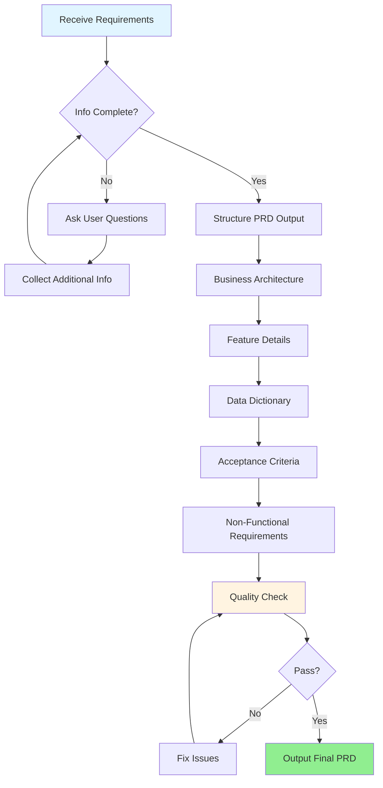
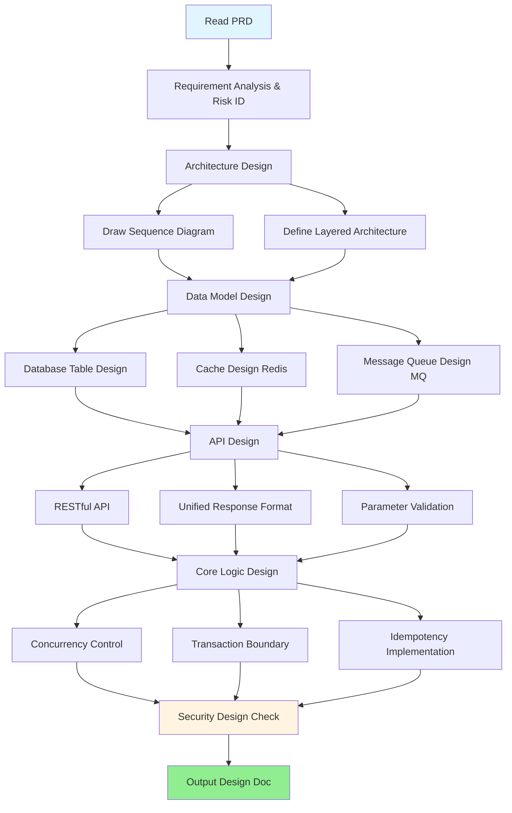
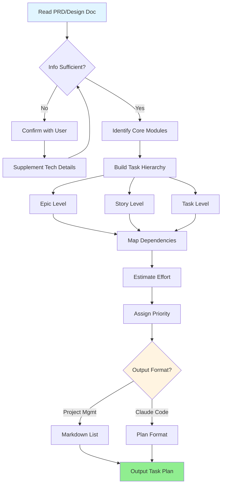
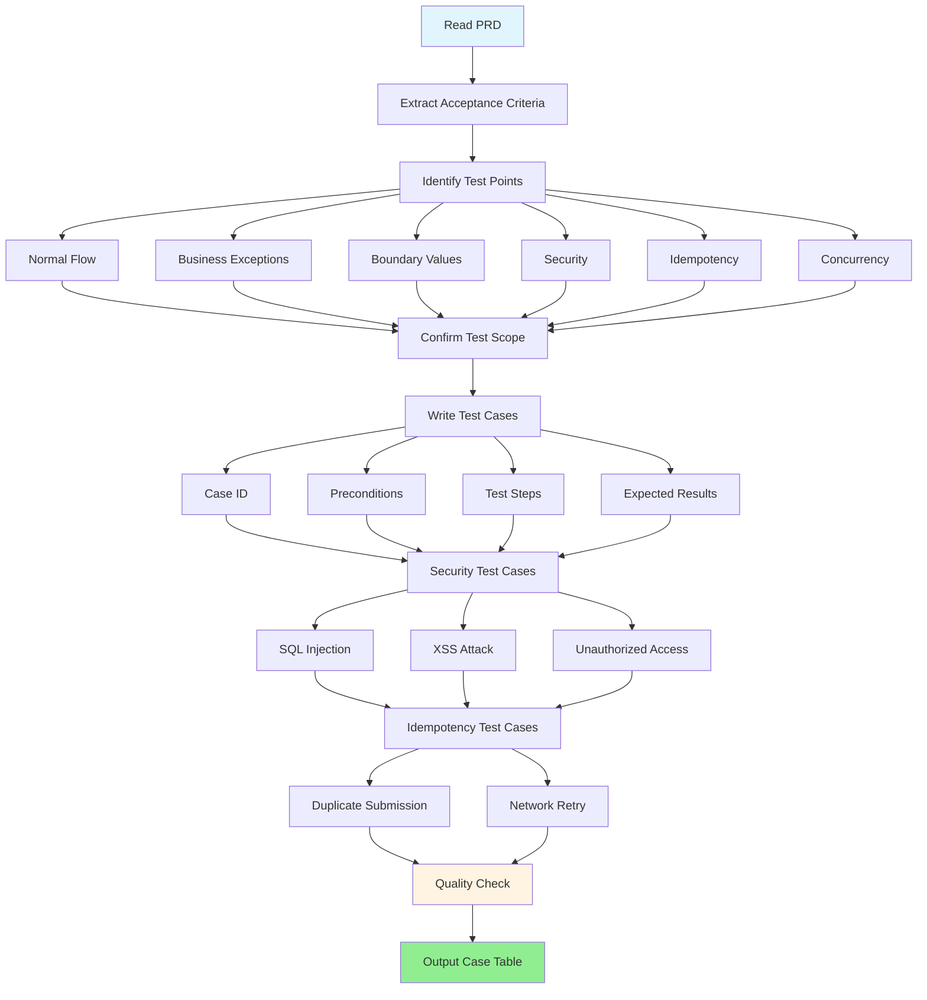
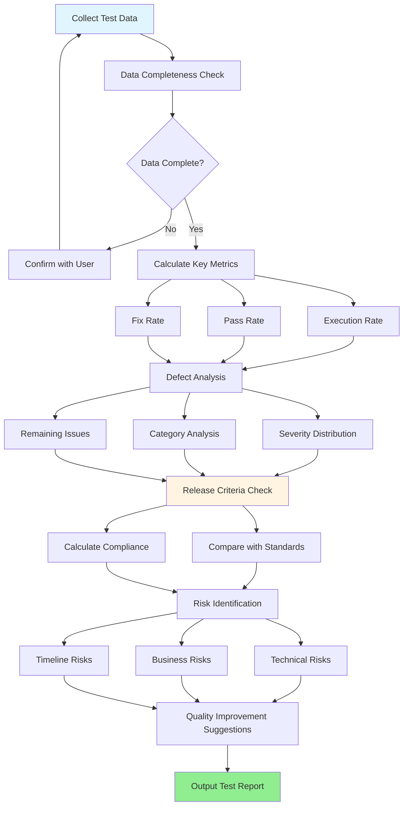

# Enterprise Product Development Workflow Skill Pack

<div align="center">

[](https://github.com/JianJang2017/jianjang-skills/tree/master/enterprise-dev-flow)
[](LICENSE)
[](https://claude.ai/code)
[](https://spring.io/projects/spring-cloud-alibaba)

English | [简体中文](README.md)

</div>

---

## 📖 Introduction

The Enterprise Product Development Workflow Skill Pack is an intelligent development assistant toolkit designed for **Claude Code**, covering the complete software development lifecycle from requirements analysis to testing and acceptance.

With 5 core skills, 25+ rule files, and 6 reference templates, it helps teams:
- ✅ Standardize Product Requirements Document (PRD) writing
- ✅ Normalize technical design documentation
- ✅ Automate task breakdown and planning
- ✅ Systematize test case design
- ✅ Professionalize test report generation

**Tech Stack:** Spring Cloud Alibaba + PostgreSQL + Redis + RocketMQ + MinIO

---

## ✨ Key Features

### 🎯 Full Lifecycle Coverage
Professional skill support for every stage from product requirements to testing acceptance, ensuring documentation consistency.

### 📚 Modular Rules
25+ granular rule files (security, database, API, code quality, Git, testing, architecture), centrally maintained and referenced on demand.

### 🔍 Automatic Quality Checks
Each skill includes built-in quality checklists, automatically validating compliance with enterprise standards before output.

### 🚀 Dual Format Output
Task planning skill outputs both project management lists (Markdown) and Claude Code Plans for different scenarios.

### 🛠️ Tech Stack Optimized
Specifically optimized for Spring Cloud Alibaba ecosystem with concrete technical implementation guidance.

---

## 🔄 Development Workflow


### Workflow Description

1. **Requirements Phase**: PM uses `prd-writer` to create standardized PRD
2. **Design Phase**: Developers use `design-writer` to transform PRD into technical design
3. **Planning Phase**: Use `task-planner` to break down tasks and generate dev plan
4. **Development Phase**: Dev team implements according to task list
5. **Test Preparation**: QA uses `test-designer` to design test cases based on PRD
6. **Test Execution**: Execute test cases and collect test data
7. **Test Summary**: Use `test-reporter` to generate test report
8. **Release Criteria**: Decide whether to launch based on test report

---

## 📦 Skill List

### 🎯 Skill Overview

| Skill | Trigger | Description |
|-------|---------|-------------|
| **prd-writer** | "write PRD", "organize requirements" | Guide PMs to output enterprise-grade PRDs with business architecture, features, NFRs, and acceptance criteria |
| **design-writer** | "write design doc", "how to design database" | Transform PRD into technical design with sequence diagrams, DDL, cache/MQ design, and API docs |
| **task-planner** | "break down tasks", "create dev plan" | Decompose PRD/design into executable tasks, output Epic/Story/Task list and Claude Code Plan |
| **test-designer** | "write test cases", "how to test this" | Systematically design test cases covering 8 dimensions: normal/exception/boundary/security/idempotency/concurrency |
| **test-reporter** | "write test report", "ready to launch?" | Generate test summary reports with case statistics, defect analysis, release criteria, and risk assessment |

---

### 📝 prd-writer - PRD Writing Skill

**Workflow:**



**Key Features:**
- ✅ Guided questioning for requirement completeness
- ✅ Auto-check security red lines and idempotency design
- ✅ Generate Given-When-Then format acceptance criteria
- ✅ Output enterprise-standard complete PRD

---

### 🏗️ design-writer - Design Documentation Skill

**Workflow:**



**Key Features:**
- ✅ Generate Mermaid sequence diagrams
- ✅ PostgreSQL DDL scripts
- ✅ Redis cache design (key conventions, consistency)
- ✅ RocketMQ message design (topic naming, idempotent consumption)
- ✅ RESTful API docs (with request/response examples)
- ✅ Concurrency control, transaction boundary, idempotency solutions

---

### 📋 task-planner - Task Planning Skill

**Workflow:**



**Key Features:**
- ✅ Epic → Story → Task three-level breakdown
- ✅ Auto-identify dependencies and critical path
- ✅ Effort estimation and priority assignment
- ✅ Dual format output:
  - Markdown list (importable to Jira/Zendao)
  - Claude Code Plan (directly executable)

---

### 🧪 test-designer - Test Case Design Skill

**Workflow:**



**Key Features:**
- ✅ 8-dimension test coverage: normal/exception/boundary/security/idempotency/concurrency/compatibility/UX
- ✅ Auto-generate security test cases (SQL injection, XSS, unauthorized access)
- ✅ Auto-generate idempotency test cases (duplicate submission, network retry)
- ✅ Output complete case table (with priority, preconditions, steps, expected results)

---

### 📊 test-reporter - Test Report Skill

**Workflow:**



**Key Features:**
- ✅ Auto-calculate key metrics (execution rate, pass rate, fix rate)
- ✅ Defect analysis (P0-P3 severity distribution, category statistics)
- ✅ Release criteria check (item-by-item verification)
- ✅ Risk assessment (technical/business/timeline risks)
- ✅ Quality improvement suggestions

---

## 🚀 Quick Start

### Installation

**Method 1: Symbolic Link (Recommended)**

```bash
# Clone or download this project
git clone https://github.com/JianJang2017/jianjang-skills.git

# Create symbolic link
ln -s $(pwd)/jianjang-skills/enterprise-dev-flow ~/.claude/skills/enterprise-dev-flow
```

**Method 2: Direct Copy**

```bash
cp -r enterprise-dev-flow ~/.claude/skills/
```

### Verify Installation

```bash
# Check skill pack
ls ~/.claude/skills/enterprise-dev-flow/skills/*/SKILL.md
```

### Use Commands

```bash
# In Claude Code
/prd:writing-prd          # Write PRD
/dev:writing-design       # Write design doc
/dev:planning-tasks       # Break down tasks
/test:designing-cases     # Design test cases
/test:writing-report      # Write test report
```

### Natural Language Triggers

You can also use natural language:

```
"Help me write a PRD for user login"
"Write detailed design based on this PRD"
"Break down this requirement into dev tasks"
"Design test cases for login feature"
"Test is done, help me write the report"
```

---

## 📚 Usage Examples

### Scenario 1: PM Writing PRD

```
👤 User: Help me write a PRD for user login feature

🤖 Claude: [Automatically triggers prd-writer skill]
I'll help you output a PRD following enterprise standards.
Let me confirm some key questions:

1. Which login methods to support?
   - Username/password
   - Phone verification code
   - Third-party login (WeChat/Alipay)

2. Need to remember login state? How long?

3. Should account be locked after consecutive failed attempts? Lock duration?

4. Support multi-device login? (PC/Mobile/Mini-program)
```

### Scenario 2: Developer Writing Design Doc

```
👤 User: Write detailed design based on this PRD

🤖 Claude: [Automatically triggers design-writer skill]
I'll transform the PRD into technical design. Let me confirm:

1. Expected concurrent users? (affects performance design)
2. Need to migrate existing user data? (affects compatibility)
3. Need to support gradual rollout? (affects API versioning)

After confirmation, I'll output:
✓ Sequence diagram (Mermaid format)
✓ Database DDL (PostgreSQL)
✓ Cache design (Redis key conventions)
✓ API documentation (RESTful + unified response format)
✓ Core logic pseudocode
```

### Scenario 3: Breaking Down Tasks

```
👤 User: Break down this design into dev tasks

🤖 Claude: [Automatically triggers task-planner skill]
I'll output two formats of task plans:

📋 Format 1: Project Management List (Markdown)
- Epic: User Login Module
  - Story: Username/Password Login
    - Task: Implement login API
    - Task: Design user table structure
    - Task: Write login unit tests
  - Story: Phone Verification Login
    ...

📝 Format 2: Claude Code Plan
Implementation plan that Claude Code can execute step by step
```

---

## 📂 Project Structure

```
enterprise-dev-flow/
├── plugin.json                 # Plugin configuration
├── commands/                   # Command aliases (5)
│   ├── prd/writing-prd.md
│   ├── dev/writing-design.md
│   ├── dev/planning-tasks.md
│   ├── test/designing-cases.md
│   └── test/writing-report.md
├── skills/                     # Core skills (5)
│   ├── prd-writer/
│   ├── design-writer/
│   ├── task-planner/
│   ├── test-designer/
│   └── test-reporter/
└── references/                 # Reference docs
    ├── common-rules.md        # Common rules
    ├── prd-template.md        # PRD template
    ├── design-template.md     # Design template
    ├── test-template.md       # Test template
    ├── api-design-rules.md    # API guidelines
    ├── git_commit_rules.md    # Git conventions
    └── rules/                 # Granular rules (25)
        ├── security/          # Security rules (2)
        ├── database/          # Database rules (4)
        ├── api/               # API rules (6)
        ├── code-quality/      # Code quality rules (4)
        ├── git/               # Git rules (3)
        ├── testing/           # Testing rules (3)
        └── architecture/      # Architecture rules (3)
```

---

## 🎓 Rule Library

### Security Rules
- Security red lines (sensitive data protection, SQL security, authorization)
- Sensitive data masking standards

### Database Rules
- Table naming convention (`t_{biz}_{scope}_{model_name}`)
- Common fields standard (6 mandatory fields)
- Index design guidelines
- SQL red lines (no SELECT *, no deep pagination, etc.)

### API Rules
- RESTful design guidelines
- Unified response format (Result<T>)
- URL naming conventions
- Parameter validation standards
- Pagination query standards
- Error code conventions

### Code Quality Rules
- Idempotency design
- State machine specifications
- Transaction boundary control
- Exception handling standards

### Git Rules
- Commit message format
- Branch naming conventions
- Pre-commit checklist

### Testing Rules
- Defect severity levels (P0-P3)
- Acceptance criteria format (Given-When-Then)
- Test coverage matrix

### Architecture Rules
- Non-functional requirements baseline
- Cache strategy (Redis)
- Message queue design (RocketMQ)

---

## 🔧 Tech Stack

This skill pack is designed for the following tech stack:

| Category | Technology |
|----------|------------|
| Backend Framework | Spring Cloud Alibaba |
| Database | PostgreSQL |
| Cache | Redis |
| Message Queue | RocketMQ |
| File Storage | MinIO |

---

## 📖 Documentation

- [Installation Guide](INSTALL.md)
- [Changelog](CHANGELOG.md)
- [Optimization Report](OPTIMIZATION_REPORT.md)
- [Rules Refactoring Summary](RULES_REFACTORING_SUMMARY.md)

---

## 🤝 Contributing

Contributions, issues, and feature requests are welcome!

1. Fork this project
2. Create your feature branch (`git checkout -b feature/AmazingFeature`)
3. Commit your changes (`git commit -m 'Add some AmazingFeature'`)
4. Push to the branch (`git push origin feature/AmazingFeature`)
5. Open a Pull Request

---

## 📄 License

This project is licensed under the MIT License - see the [LICENSE](LICENSE) file for details

---

## 👥 Maintainers

**Enterprise Dev Team**

---

## 🙏 Acknowledgments

Thanks to all contributors who have helped this project!

---

## 📮 Contact

- Submit Issues: [GitHub Issues](https://github.com/JianJang2017/jianjang-skills/issues)
- Email: jianjang2017@gmail.com

---

<div align="center">

**If this project helps you, please give it a ⭐️ Star!**

Made with ❤️ by Enterprise Dev Team

</div>
