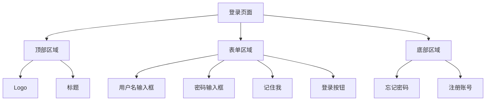
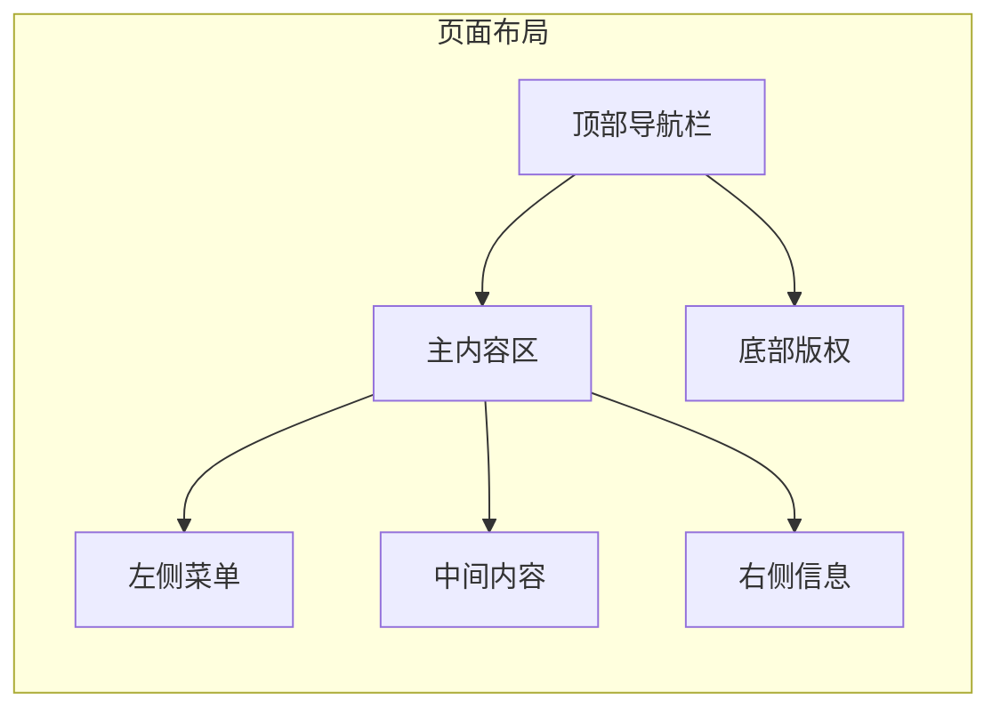
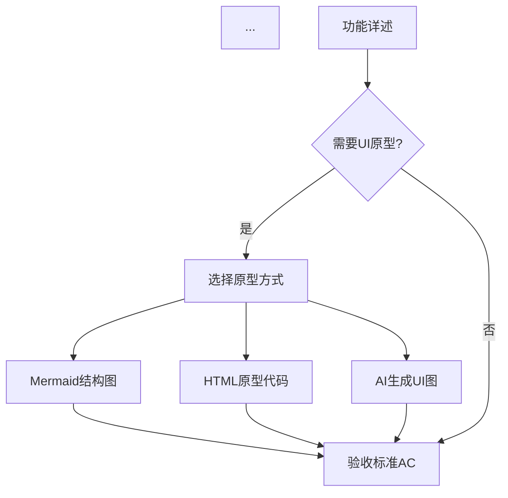

# PRD 阶段 UI 原型生成方案

**版本：** v1.0
**创建日期：** 2026-03-23
**适用技能：** prd-writer

---

## 📋 方案概述

在 PRD 撰写阶段集成 UI 原型生成能力，让需求文档更加直观，提升团队沟通效率。

---

## 🎯 方案对比

### 方案一：低保真原型（Mermaid 图表）

**适用场景：** 快速迭代、结构展示、流程说明

**实现方式：**

#### 1. 页面结构图


#### 2. 页面布局图


**优点：**
- ✅ 纯文本，易于版本控制
- ✅ GitHub 原生支持
- ✅ 快速迭代
- ✅ 适合表达结构和流程

**缺点：**
- ❌ 视觉效果有限
- ❌ 无法展示具体样式

---

### 方案二：中保真原型（HTML/CSS 代码）

**适用场景：** 可交互演示、快速验证、研发参考

**实现方式：**

#### 1. 生成 HTML 原型代码

```html
<!DOCTYPE html>
<html lang="zh-CN">
<head>
    <meta charset="UTF-8">
    <meta name="viewport" content="width=device-width, initial-scale=1.0">
    <title>登录页面原型</title>
    <style>
        * {
            margin: 0;
            padding: 0;
            box-sizing: border-box;
        }

        body {
            font-family: -apple-system, BlinkMacSystemFont, 'Segoe UI', Roboto, sans-serif;
            background: linear-gradient(135deg, #667eea 0%, #764ba2 100%);
            min-height: 100vh;
            display: flex;
            align-items: center;
            justify-content: center;
        }

        .login-container {
            background: white;
            padding: 40px;
            border-radius: 12px;
            box-shadow: 0 10px 40px rgba(0,0,0,0.1);
            width: 100%;
            max-width: 400px;
        }

        .logo {
            text-align: center;
            margin-bottom: 30px;
        }

        .logo h1 {
            color: #333;
            font-size: 28px;
            margin-bottom: 8px;
        }

        .logo p {
            color: #999;
            font-size: 14px;
        }

        .form-group {
            margin-bottom: 20px;
        }

        .form-group label {
            display: block;
            margin-bottom: 8px;
            color: #333;
            font-size: 14px;
            font-weight: 500;
        }

        .form-group input {
            width: 100%;
            padding: 12px 16px;
            border: 1px solid #ddd;
            border-radius: 6px;
            font-size: 14px;
            transition: border-color 0.3s;
        }

        .form-group input:focus {
            outline: none;
            border-color: #667eea;
        }

        .form-options {
            display: flex;
            justify-content: space-between;
            align-items: center;
            margin-bottom: 24px;
        }

        .remember-me {
            display: flex;
            align-items: center;
            font-size: 14px;
            color: #666;
        }

        .remember-me input {
            margin-right: 6px;
        }

        .forgot-password {
            color: #667eea;
            text-decoration: none;
            font-size: 14px;
        }

        .forgot-password:hover {
            text-decoration: underline;
        }

        .btn-login {
            width: 100%;
            padding: 14px;
            background: linear-gradient(135deg, #667eea 0%, #764ba2 100%);
            color: white;
            border: none;
            border-radius: 6px;
            font-size: 16px;
            font-weight: 500;
            cursor: pointer;
            transition: transform 0.2s;
        }

        .btn-login:hover {
            transform: translateY(-2px);
        }

        .register-link {
            text-align: center;
            margin-top: 20px;
            font-size: 14px;
            color: #666;
        }

        .register-link a {
            color: #667eea;
            text-decoration: none;
            font-weight: 500;
        }

        .register-link a:hover {
            text-decoration: underline;
        }
    </style>
</head>
<body>
    <div class="login-container">
        <div class="logo">
            <h1>企业管理系统</h1>
            <p>欢迎登录</p>
        </div>

        <form>
            <div class="form-group">
                <label for="username">用户名</label>
                <input type="text" id="username" placeholder="请输入用户名" required>
            </div>

            <div class="form-group">
                <label for="password">密码</label>
                <input type="password" id="password" placeholder="请输入密码" required>
            </div>

            <div class="form-options">
                <label class="remember-me">
                    <input type="checkbox">
                    记住我
                </label>
                <a href="#" class="forgot-password">忘记密码？</a>
            </div>

            <button type="submit" class="btn-login">登录</button>
        </form>

        <div class="register-link">
            还没有账号？<a href="#">立即注册</a>
        </div>
    </div>
</body>
</html>
```

**使用方式：**
1. 将代码保存为 `.html` 文件
2. 在浏览器中打开预览
3. 可以直接调整样式和布局

**优点：**
- ✅ 可直接在浏览器预览
- ✅ 可交互演示
- ✅ 研发可参考代码
- ✅ 快速调整样式

**缺点：**
- ❌ 需要前端知识
- ❌ 不如专业设计工具美观

---

### 方案三：高保真原型（AI 生成图片）

**适用场景：** 正式评审、客户演示、视觉设计参考

**实现方式：**

#### 1. 集成 baoyu-image-gen 技能

在 prd-writer 中添加 UI 生成步骤，调用现有的图像生成技能。

**Prompt 模板：**

```
生成一个企业级后台管理系统的登录页面UI设计图：

【布局要求】
- 居中布局，白色卡片容器
- 卡片宽度 400px，圆角 12px
- 背景使用渐变色（紫色系）

【元素要求】
- 顶部：公司Logo + 系统名称
- 中间：用户名输入框 + 密码输入框
- 底部：记住我复选框 + 忘记密码链接
- 主按钮：蓝紫色渐变，圆角
- 注册链接：底部居中

【设计风格】
- 现代简约风格
- 商务专业感
- 配色：主色 #667eea，辅色 #764ba2
- 阴影：柔和的投影效果

【参考】
类似 Ant Design / Element UI 的设计风格
```

#### 2. 生成多个版本

```
版本A - 极简风格：
- 纯白背景
- 最少的装饰元素
- 扁平化设计

版本B - 商务风格：
- 深色背景
- 金色点缀
- 专业稳重

版本C - 科技感风格：
- 渐变背景
- 发光效果
- 未来感设计
```

**优点：**
- ✅ 视觉效果专业
- ✅ 适合正式评审
- ✅ 可快速生成多个版本
- ✅ 无需设计技能

**缺点：**
- ❌ 需要调用外部服务
- ❌ 可能需要多次调整 Prompt
- ❌ 无法直接交互

---

## 🚀 推荐实施方案

### 阶段一：快速验证（方案一）

**使用场景：** 需求初期，快速沟通

**实施步骤：**
1. 在 PRD 中使用 Mermaid 绘制页面结构图
2. 标注关键元素和交互流程
3. 快速迭代，确认需求

### 阶段二：详细设计（方案二）

**使用场景：** 需求确认后，研发参考

**实施步骤：**
1. 生成 HTML/CSS 原型代码
2. 在浏览器中预览和调整
3. 作为研发的参考实现

### 阶段三：正式评审（方案三）

**使用场景：** 客户演示，高层评审

**实施步骤：**
1. 调用 baoyu-image-gen 生成高保真UI图
2. 生成多个版本供选择
3. 确定最终设计方向

---

## 📝 集成到 prd-writer 的具体实现

### 修改 SKILL.md

在"第二步：结构化输出PRD"之后，添加新的步骤：

```markdown
### 第二步半：UI 原型设计（可选）

如果用户需要 UI 原型，根据需求阶段选择合适的方式：

#### 1. 快速验证阶段（推荐）

使用 Mermaid 绘制页面结构图：

\`\`\`mermaid
graph TD
    A[页面名称] --> B[区域1]
    A --> C[区域2]
    B --> B1[元素1]
    B --> B2[元素2]
\`\`\`

#### 2. 详细设计阶段

生成 HTML/CSS 原型代码，保存为独立文件：
- 文件名：`prototype_[页面名称].html`
- 包含完整的样式和布局
- 可在浏览器中直接预览

#### 3. 正式评审阶段

调用 baoyu-image-gen 技能生成高保真UI图：

**提示用户：**
"我可以为你生成专业的UI设计图，请确认：
1. 设计风格偏好（极简/商务/科技感）
2. 主色调偏好
3. 是否需要多个版本对比"

**生成步骤：**
1. 构建详细的 Prompt（包含布局、元素、风格要求）
2. 调用 `/baoyu-image-gen` 生成图片
3. 将生成的图片链接插入到 PRD 文档中

**在 PRD 中的展示格式：**
\`\`\`markdown
## 3.2 界面设计

### 登录页面

**页面结构：**
[Mermaid 结构图]

**原型预览：**


**设计说明：**
- 布局：居中卡片式布局
- 主色调：#667eea（蓝紫色）
- 关键元素：Logo、表单、主按钮
- 交互状态：输入框聚焦、按钮悬停效果
\`\`\`
```

### 更新流程图

在 prd-writer 的流程图中添加 UI 设计分支：



---

## 🎨 最佳实践

### 1. Prompt 编写技巧

**好的 Prompt：**
```
生成一个企业级CRM系统的客户列表页面：
- 顶部：搜索栏 + 筛选器 + 新建按钮
- 中间：数据表格（客户名称、联系人、状态、操作）
- 底部：分页器
- 风格：Ant Design Pro 风格
- 配色：主色 #1890ff
```

**不好的 Prompt：**
```
生成一个客户列表页面
```

### 2. 版本管理

```
prototypes/
├── v1_login_page.html          # 第一版
├── v2_login_page.html          # 第二版（调整后）
├── login_page_simple.png       # 极简风格
├── login_page_business.png     # 商务风格
└── login_page_tech.png         # 科技风格
```

### 3. 文档组织

在 PRD 中为每个页面创建独立章节：

```markdown
## 3. 功能需求

### 3.1 用户登录

#### 3.1.1 功能描述
[文字描述]

#### 3.1.2 界面设计
[UI 原型]

#### 3.1.3 业务规则
[规则说明]

#### 3.1.4 数据字典
[字段定义]

#### 3.1.5 验收标准
[AC 列表]
```

---

## 📊 效果对比

| 方案 | 制作时间 | 视觉效果 | 交互性 | 适用阶段 | 推荐度 |
|------|---------|---------|--------|---------|--------|
| Mermaid 图表 | 5分钟 | ⭐⭐⭐ | ❌ | 需求初期 | ⭐⭐⭐⭐⭐ |
| HTML 原型 | 15分钟 | ⭐⭐⭐⭐ | ✅ | 详细设计 | ⭐⭐⭐⭐ |
| AI 生成图片 | 10分钟 | ⭐⭐⭐⭐⭐ | ❌ | 正式评审 | ⭐⭐⭐⭐⭐ |

---

## 🔧 技术实现

### 调用 baoyu-image-gen 的代码示例

```markdown
在 prd-writer 技能中，当需要生成 UI 图时：

1. 检测用户需求：
   - 用户说"需要UI图"、"画个界面"、"设计一下页面"

2. 构建 Prompt：
   - 收集页面信息（布局、元素、风格）
   - 生成详细的设计描述

3. 调用技能：
   使用 Skill 工具调用 baoyu-image-gen：

   /baoyu-image-gen "生成企业级后台登录页面，居中卡片布局，
   包含Logo、用户名密码输入框、登录按钮，现代简约风格，
   主色调蓝紫色渐变"

4. 处理结果：
   - 将生成的图片保存到 prototypes/ 目录
   - 在 PRD 中插入图片引用
```

---

## 💡 总结

**推荐组合方案：**

1. **需求初期**：使用 Mermaid 快速绘制结构图
2. **需求确认**：生成 HTML 原型供研发参考
3. **正式评审**：调用 AI 生成高保真UI图

这样可以在不同阶段使用最合适的工具，既保证效率又保证质量。

---

**下一步行动：**
1. 是否需要我帮你修改 prd-writer/SKILL.md，集成 UI 原型生成功能？
2. 是否需要创建 UI 原型模板库？
3. 是否需要编写详细的 Prompt 模板？
