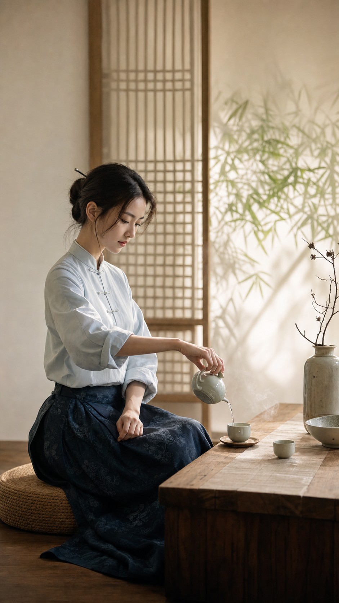
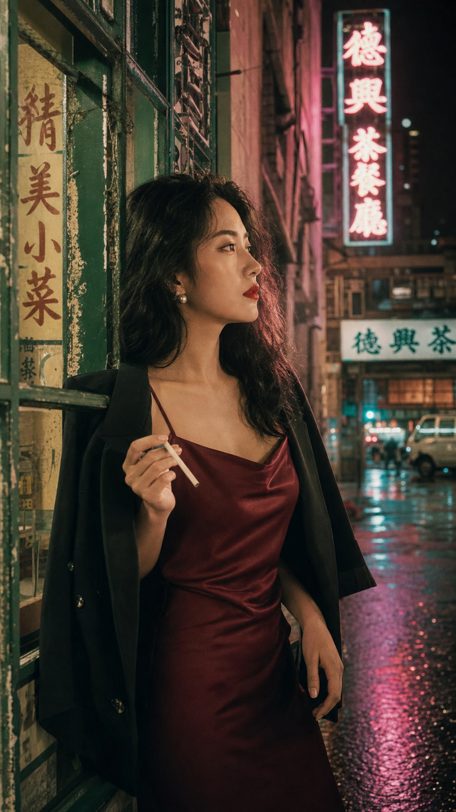
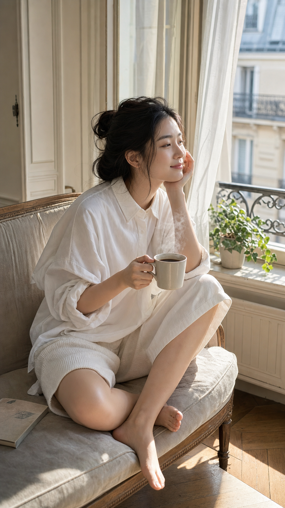
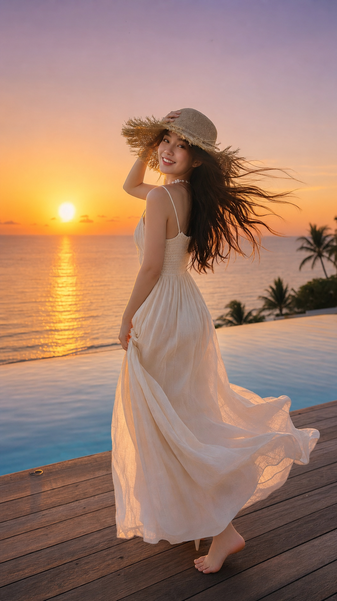
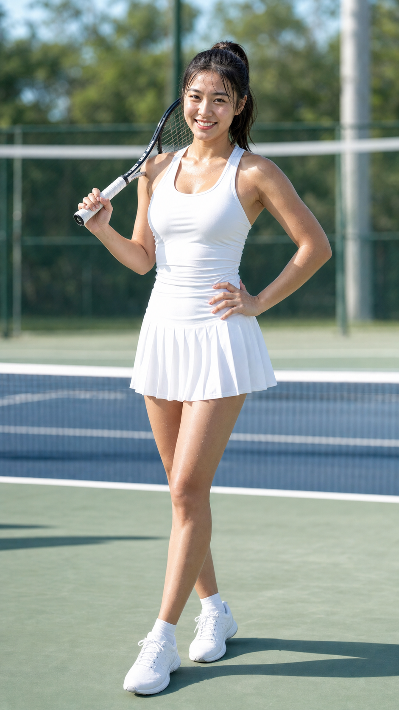
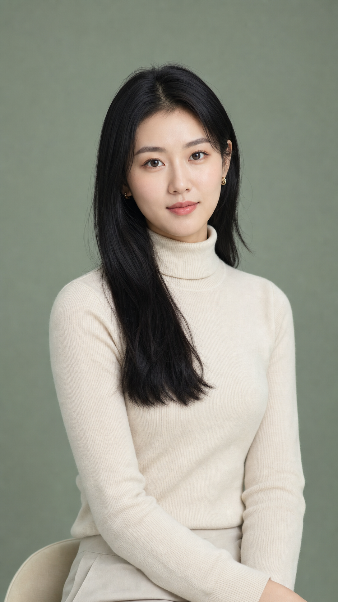
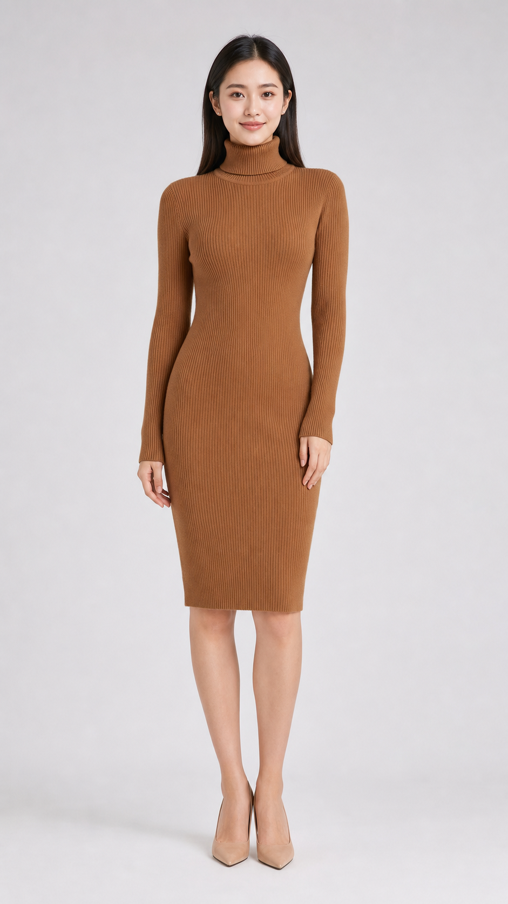
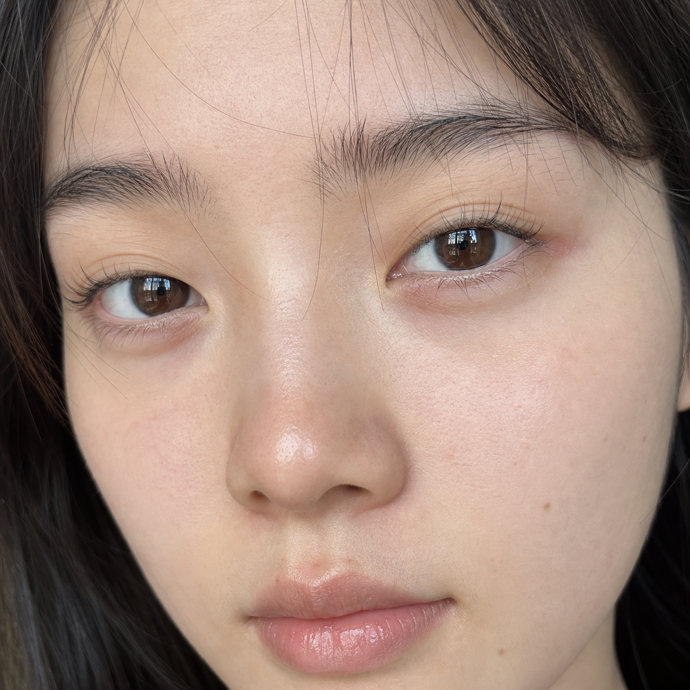
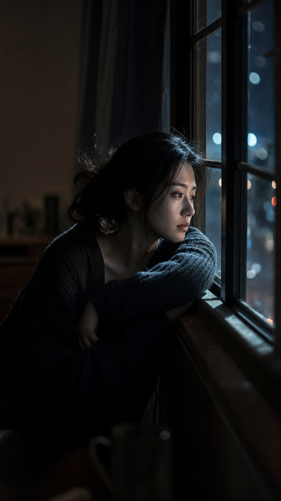

<!-- LANG_SWITCH -->
[中文](./README.md) | **English**

# Image Prompt Factory 🎨

> A Claude skill that generates professional image prompts for **GPT-image / DALL-E**.

Core idea: **picture the scene clearly in your head first, then describe it in flowing natural language** — instead of filling in a rigid template cell by cell. GPT-image responds best to paragraph-style natural language, a sense of scene, and internal logic, so this skill produces **coherent descriptive prompts** rather than loose tag strings.

## ✨ Features

- **18 styles**: Ancient/Guofeng, Japanese, Korean/CCD, Urban street, Office/intellectual, Loungewear/soft-light, Beach/vacation, 3D CG, Lifestyle, New-Chinese, Retro Hong Kong, French-lazy, Travel/vacation, Sporty/active, Studio-retouched, E-commerce try-on, Ultra-close real face, Low-key cinematic
- **Optimized for GPT-image**: paragraph-style natural language, no negative prompts / SD spells / MJ parameters
- **Style DNA cards**: a dedicated reference per style with trigger words, visual traits, language style, and writing tips
- **Standard demos + real sample images**: every style ships a ready-to-reuse prompt and its generated image
- **Configurable aspect ratio**: defaults to 9:16 vertical (social-media friendly), also supports 16:9 / 1:1
- **Extensible**: add your own styles following `references/extension-guide.md`

## 🚀 Usage

Trigger it in Claude with plain natural language (Chinese or English):

```
"Write me an image prompt for an ancient-style noble lady in a spring courtyard, pink hanfu"
"I want a Korean CCD-style photo, late-night cafe"
"Give me a generation prompt, office / intellectual style"
```

The skill will:
1. Identify the style direction
2. Read the matching style DNA (`references/`)
3. Reference the standard demo (`prompts/examples/`)
4. Picture the scene, then output a paragraph-style prompt in natural language

## 📐 Output format

```
【Style】[style name · sub-category]
【Aspect】1024x1792 (9:16 vertical)

【Prompt】
[2-4 natural paragraphs: scene+subject → outfit+makeup → pose+background → light+lens+texture]
```

## 📂 Structure

```
image-prompt-factory/
├── SKILL.md                    # Core workflow
├── README.md                   # Chinese docs
├── README.en.md                # English docs (this file)
├── references/                 # Style DNA cards + general spec
│   ├── 01-guofeng.md ~ 18-low-key-cinematic.md
│   ├── prompt-template.md      # General writing spec
│   └── extension-guide.md      # Extension guide
└── prompts/
    ├── examples/               # 18 standard demo prompts
    └── images/                 # matching generated sample images
```

---

## 🖼️ Style samples & images

Click any image or **📄 prompt** to view the full standard demo for that style (GPT-image / codex channel, 9:16 vertical).

<table>
<tr><td align="center" width="33%"><a href="prompts/examples/01-guofeng-example.md"></a><br><b>Ancient / Guofeng</b><br><sub><a href="prompts/examples/01-guofeng-example.md">📄 prompt</a></sub></td><td align="center" width="33%"><a href="prompts/examples/02-japanese-example.md"></a><br><b>Japanese</b><br><sub><a href="prompts/examples/02-japanese-example.md">📄 prompt</a></sub></td><td align="center" width="33%"><a href="prompts/examples/03-korean-ccd-example.md"></a><br><b>Korean / CCD</b><br><sub><a href="prompts/examples/03-korean-ccd-example.md">📄 prompt</a></sub></td></tr>
<tr><td align="center" width="33%"><a href="prompts/examples/04-urban-example.md"></a><br><b>Urban / Street</b><br><sub><a href="prompts/examples/04-urban-example.md">📄 prompt</a></sub></td><td align="center" width="33%"><a href="prompts/examples/05-workplace-example.md"></a><br><b>Office / Intellectual</b><br><sub><a href="prompts/examples/05-workplace-example.md">📄 prompt</a></sub></td><td align="center" width="33%"><a href="prompts/examples/06-homewear-example.md"></a><br><b>Loungewear / Home</b><br><sub><a href="prompts/examples/06-homewear-example.md">📄 prompt</a></sub></td></tr>
<tr><td align="center" width="33%"><a href="prompts/examples/07-swimwear-example.md"></a><br><b>Swimwear / Beach</b><br><sub><a href="prompts/examples/07-swimwear-example.md">📄 prompt</a></sub></td><td align="center" width="33%"><a href="prompts/examples/08-3dcg-example.md"></a><br><b>3D CG / Fantasy</b><br><sub><a href="prompts/examples/08-3dcg-example.md">📄 prompt</a></sub></td><td align="center" width="33%"><a href="prompts/examples/09-lifestyle-example.md"></a><br><b>Lifestyle</b><br><sub><a href="prompts/examples/09-lifestyle-example.md">📄 prompt</a></sub></td></tr>
<tr><td align="center" width="33%"><a href="prompts/examples/10-new-chinese-example.md"></a><br><b>New-Chinese / Oriental</b><br><sub><a href="prompts/examples/10-new-chinese-example.md">📄 prompt</a></sub></td><td align="center" width="33%"><a href="prompts/examples/11-hongkong-retro-example.md"></a><br><b>Retro Hong Kong</b><br><sub><a href="prompts/examples/11-hongkong-retro-example.md">📄 prompt</a></sub></td><td align="center" width="33%"><a href="prompts/examples/12-french-lazy-example.md"></a><br><b>French-lazy</b><br><sub><a href="prompts/examples/12-french-lazy-example.md">📄 prompt</a></sub></td></tr>
<tr><td align="center" width="33%"><a href="prompts/examples/13-travel-vacation-example.md"></a><br><b>Travel / vacation</b><br><sub><a href="prompts/examples/13-travel-vacation-example.md">📄 prompt</a></sub></td><td align="center" width="33%"><a href="prompts/examples/14-sporty-active-example.md"></a><br><b>Sporty / active</b><br><sub><a href="prompts/examples/14-sporty-active-example.md">📄 prompt</a></sub></td><td align="center" width="33%"><a href="prompts/examples/15-studio-retouched-example.md"></a><br><b>Studio-retouched</b><br><sub><a href="prompts/examples/15-studio-retouched-example.md">📄 prompt</a></sub></td></tr>
<tr><td align="center" width="33%"><a href="prompts/examples/16-ecommerce-tryon-example.md"></a><br><b>E-commerce try-on</b><br><sub><a href="prompts/examples/16-ecommerce-tryon-example.md">📄 prompt</a></sub></td><td align="center" width="33%"><a href="prompts/examples/17-ultra-close-real-face-example.md"></a><br><b>Ultra-close real face</b><br><sub><a href="prompts/examples/17-ultra-close-real-face-example.md">📄 prompt</a></sub></td><td align="center" width="33%"><a href="prompts/examples/18-low-key-cinematic-example.md"></a><br><b>Low-key cinematic</b><br><sub><a href="prompts/examples/18-low-key-cinematic-example.md">📄 prompt</a></sub></td></tr>
</table>

---

## 🔧 Adding a new style

See `references/extension-guide.md`. Roughly three steps:
1. Add a style DNA card `10-yourstyle.md` under `references/`
2. Add a standard demo under `prompts/examples/`
3. Register it in the style list in `SKILL.md`

## ⚠️ Notes

- All subjects in the prompts are **adults** (ages 22-28); no minor-related descriptions
- Sample images are generated via the GPT-image / codex channel, for skill demonstration only
- Generation never impersonates real people's names or identities
