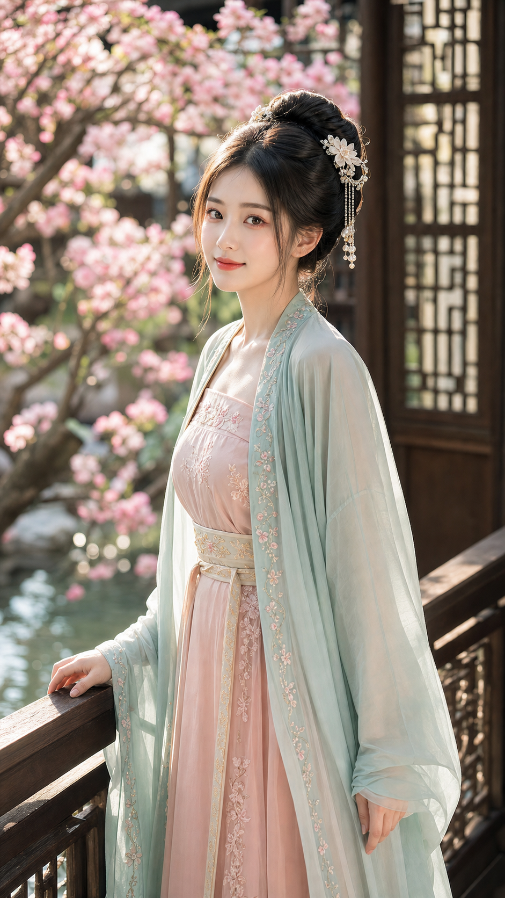
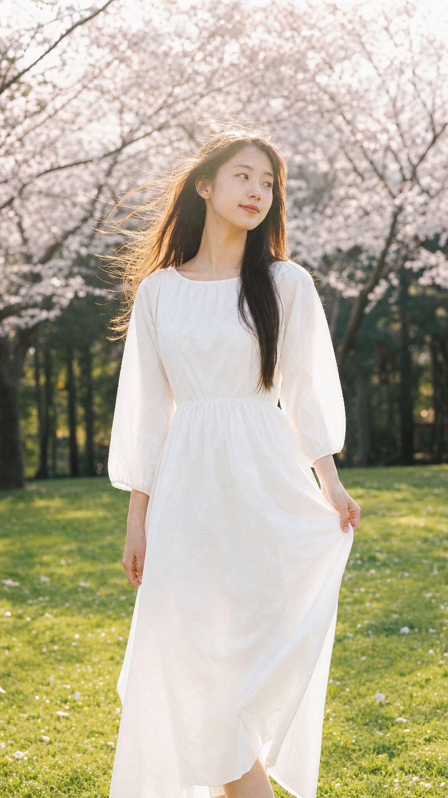
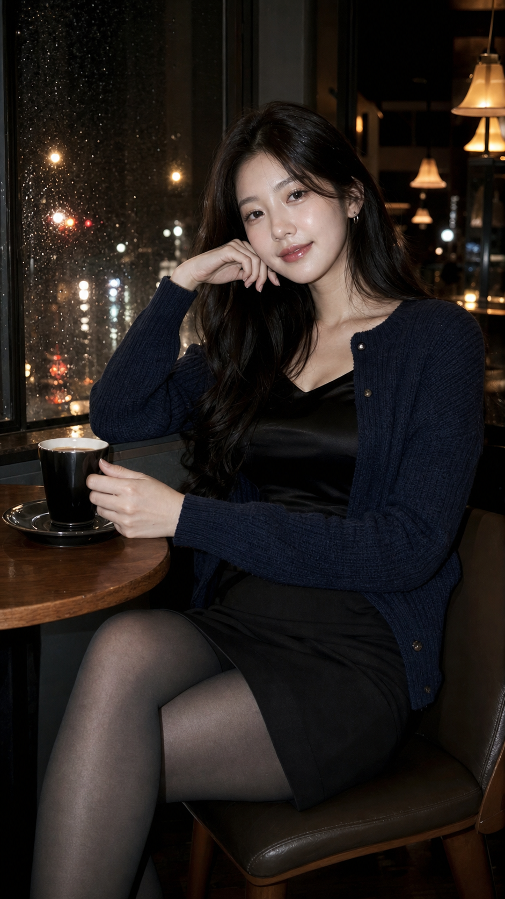
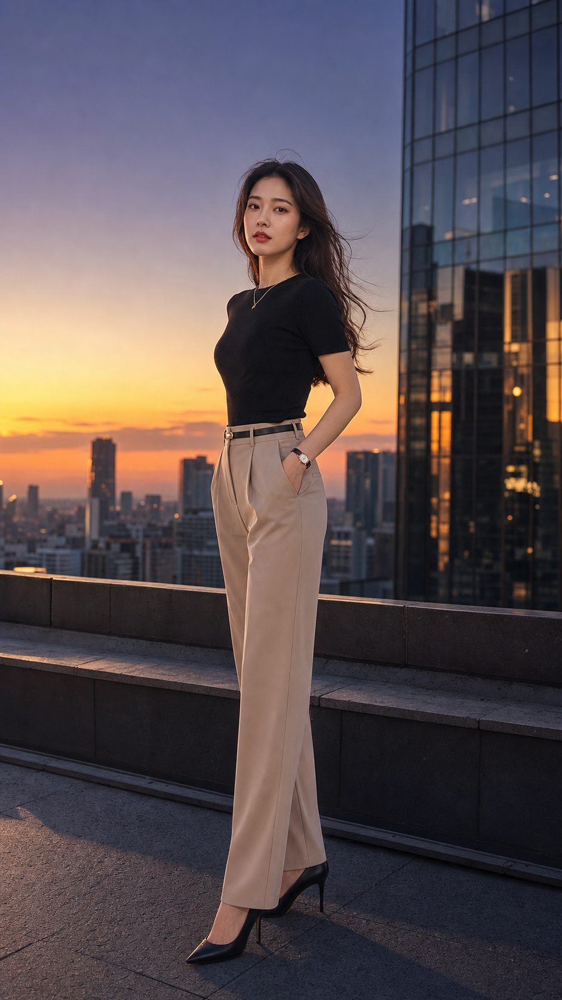
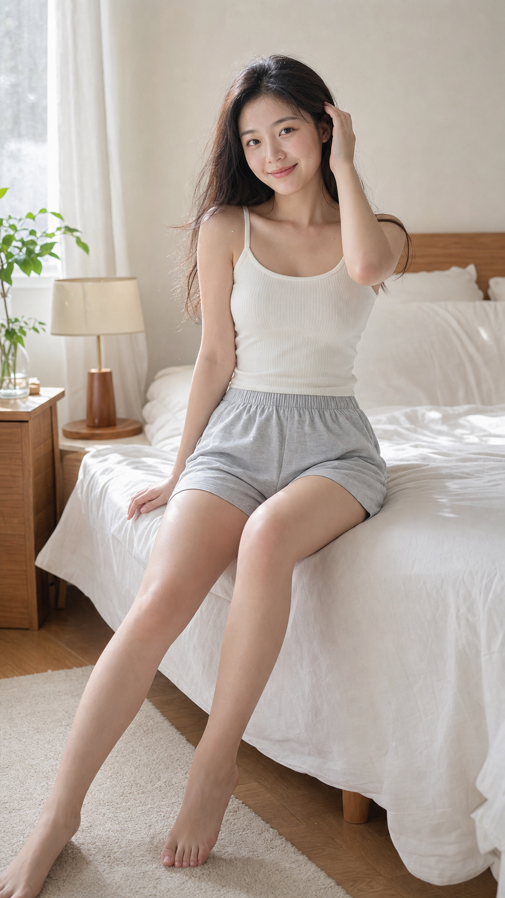
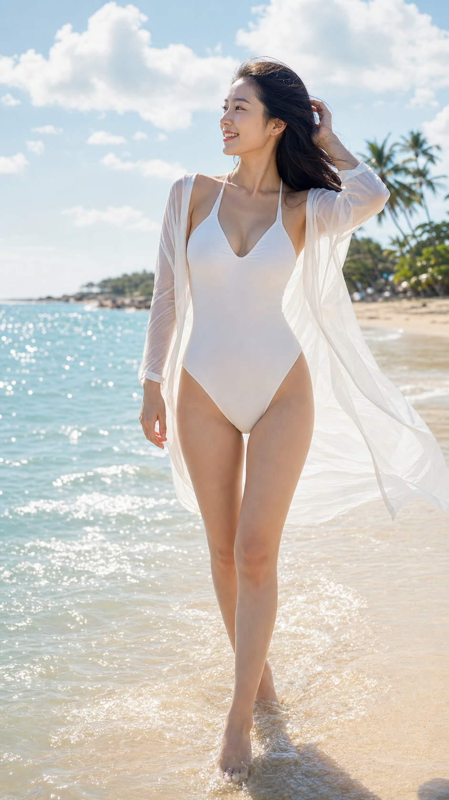
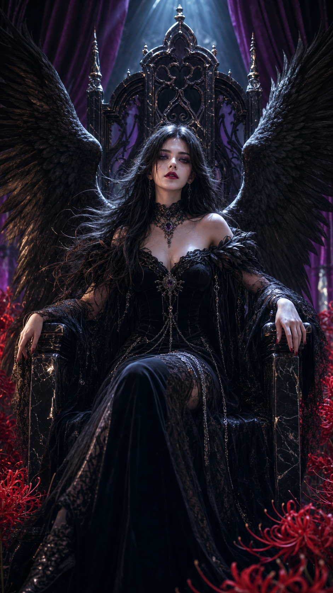
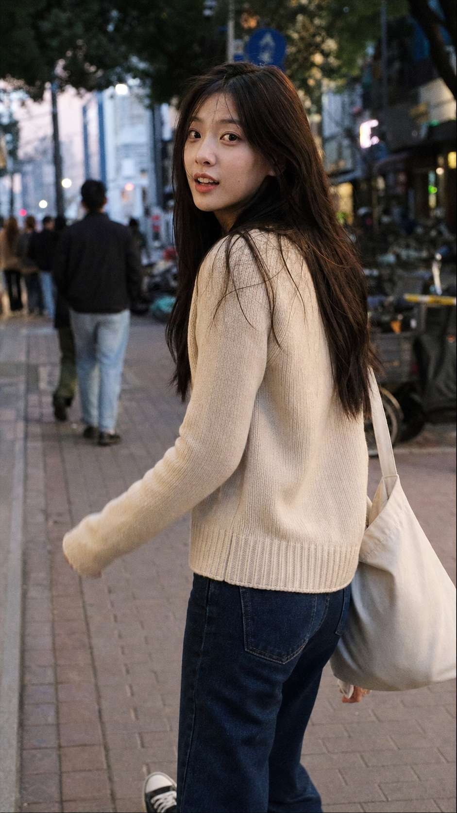

<!-- LANG_SWITCH -->
**中文** | [English](./README.en.md)

# Image Prompt Factory 🎨

> 为 **GPT-image / DALL-E** 生成专业图片提示词的 Claude 技能。

核心理念:**先在脑中把画面看清楚,再用自然语言流畅地描述出来**,而不是逐格填模板。GPT-image 对段落式自然语言、场景感和内部逻辑响应最好,因此本技能生成的是**连贯的描述性 prompt**,而非零散的标签串。

## ✨ 特性

- **18 大风格**:古风、日系、韩系/CCD、都市街拍、职场知性、居家柔光、海边度假、3D CG、生活写真、新中式、复古港风、法式慵懒、旅行假日、活力运动、影楼精修、电商试衣、超近景真脸、低调电影感
- **针对 GPT-image 优化**:自然语言段落式,不输出 negative prompt / SD 咒语 / MJ 参数
- **风格 DNA 卡**:每个风格独立的参考文件,含触发词、视觉特征、语言风格、写作提示
- **标准 Demo + 实拍样图**:每个风格都有可直接复用的 prompt 和对应生成图
- **画幅可定义**:默认 9:16 竖版(社媒友好),支持 16:9 / 1:1 等
- **可扩展**:按 `references/extension-guide.md` 可自行新增风格

## 🚀 使用方式

在 Claude 中直接用自然语言触发:

```
"帮我生成一个春日古风贵女的图片提示词,穿粉色汉服,在庭院里"
"我想要一张韩系 CCD 风格的照片,深夜咖啡馆"
"给我写个生图 prompt,职场知性风"
```

技能会:
1. 识别风格方向
2. 读取对应的风格 DNA(`references/`)
3. 参考标准 demo(`prompts/examples/`)
4. 在脑中构建画面,用自然语言输出段落式 prompt

## 📐 输出格式

```
【风格】[风格名称 · 子分类]
【画幅】1024x1792 (9:16竖版)

【Prompt】
[2-4 个自然段落: 场景+人物 → 服装+妆容 → 姿态+背景 → 光线+镜头+质感]
```

## 📂 目录结构

```
image-prompt-factory/
├── SKILL.md                    # 核心工作流
├── README.md                   # 中文说明(本文件)
├── README.en.md                # 英文说明
├── references/                 # 风格 DNA 卡 + 通用规范
│   ├── 01-guofeng.md ~ 18-low-key-cinematic.md
│   ├── prompt-template.md      # 通用写作规范
│   └── extension-guide.md      # 扩展指南
└── prompts/
    ├── examples/               # 18 个标准 demo prompt
    └── images/                 # 对应的实际生成样图
```

---

## 🖼️ 风格样例与样图

点击任意图片或 **📄 prompt** 查看该风格的完整标准 demo(GPT-image / codex 通道,9:16 竖版)。

<table>
<tr><td align="center" width="33%"><a href="prompts/examples/01-guofeng-example.md"></a><br><b>古风 / 国风 / 仙侠</b><br><sub><a href="prompts/examples/01-guofeng-example.md">📄 prompt</a></sub></td><td align="center" width="33%"><a href="prompts/examples/02-japanese-example.md"></a><br><b>日系</b><br><sub><a href="prompts/examples/02-japanese-example.md">📄 prompt</a></sub></td><td align="center" width="33%"><a href="prompts/examples/03-korean-ccd-example.md"></a><br><b>韩系 / CCD</b><br><sub><a href="prompts/examples/03-korean-ccd-example.md">📄 prompt</a></sub></td></tr>
<tr><td align="center" width="33%"><a href="prompts/examples/04-urban-example.md"></a><br><b>都市 / 街拍</b><br><sub><a href="prompts/examples/04-urban-example.md">📄 prompt</a></sub></td><td align="center" width="33%"><a href="prompts/examples/05-workplace-example.md"></a><br><b>职场 / 知性</b><br><sub><a href="prompts/examples/05-workplace-example.md">📄 prompt</a></sub></td><td align="center" width="33%"><a href="prompts/examples/06-homewear-example.md"></a><br><b>纯欲 / 居家</b><br><sub><a href="prompts/examples/06-homewear-example.md">📄 prompt</a></sub></td></tr>
<tr><td align="center" width="33%"><a href="prompts/examples/07-swimwear-example.md"></a><br><b>泳装 / 海边</b><br><sub><a href="prompts/examples/07-swimwear-example.md">📄 prompt</a></sub></td><td align="center" width="33%"><a href="prompts/examples/08-3dcg-example.md"></a><br><b>3D CG / 幻想</b><br><sub><a href="prompts/examples/08-3dcg-example.md">📄 prompt</a></sub></td><td align="center" width="33%"><a href="prompts/examples/09-lifestyle-example.md"></a><br><b>生活写真</b><br><sub><a href="prompts/examples/09-lifestyle-example.md">📄 prompt</a></sub></td></tr>
</table>

### 新增风格(样图待补)

以下 9 个风格已有完整的风格 DNA 卡和标准 demo,样图后续补入九宫格:

| 风格 | 一句话定位 | 标准 demo |
| --- | --- | --- |
| 新中式 / 东方美学 | 茶室屏风、改良新中式、留白静气(≠古装剧) | [📄 prompt](prompts/examples/10-new-chinese-example.md) |
| 复古港风 | 旧港片剧照、霓虹侧光、低饱和胶片 | [📄 prompt](prompts/examples/11-hongkong-retro-example.md) |
| 法式慵懒 | 奶油暖白、公寓晨光、松弛优雅 | [📄 prompt](prompts/examples/12-french-lazy-example.md) |
| 旅行假日 | 度假旅拍、海岛日落、目的地氛围 | [📄 prompt](prompts/examples/13-travel-vacation-example.md) |
| 活力运动 | 网球跑道健身、健康线条、元气动感 | [📄 prompt](prompts/examples/14-sporty-active-example.md) |
| 影楼精修 | 专业棚拍、干净布光、商业形象照 | [📄 prompt](prompts/examples/15-studio-retouched-example.md) |
| 电商试衣 / 服装模特 | 电商主图、还原服装、不要色差 | [📄 prompt](prompts/examples/16-ecommerce-tryon-example.md) |
| 超近景真实人脸 | 怼脸原片、毛孔微纹理、去 AI 感 | [📄 prompt](prompts/examples/17-ultra-close-real-face-example.md) |
| 低调电影感 | 暗调静帧、可读暗部、叙事情绪 | [📄 prompt](prompts/examples/18-low-key-cinematic-example.md) |

---

## 🔧 扩展新风格

参考 `references/extension-guide.md`,大致三步:
1. 在 `references/` 新增 `10-yourstyle.md` 风格 DNA 卡
2. 在 `prompts/examples/` 新增标准 demo
3. 在 `SKILL.md` 的风格分类列表登记

## ⚠️ 注意

- 所有 prompt 中的人物均为**成年**(22-28岁),不涉及未成年描述
- 样图由 GPT-image / codex 通道生成,仅作技能演示用途
- 生成时不冒用真人姓名或身份
