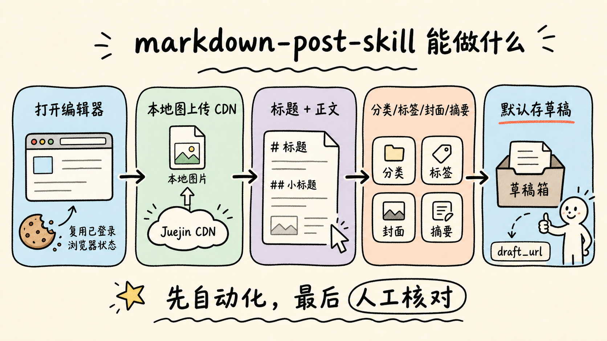
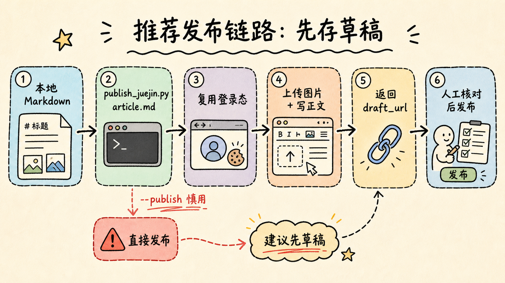
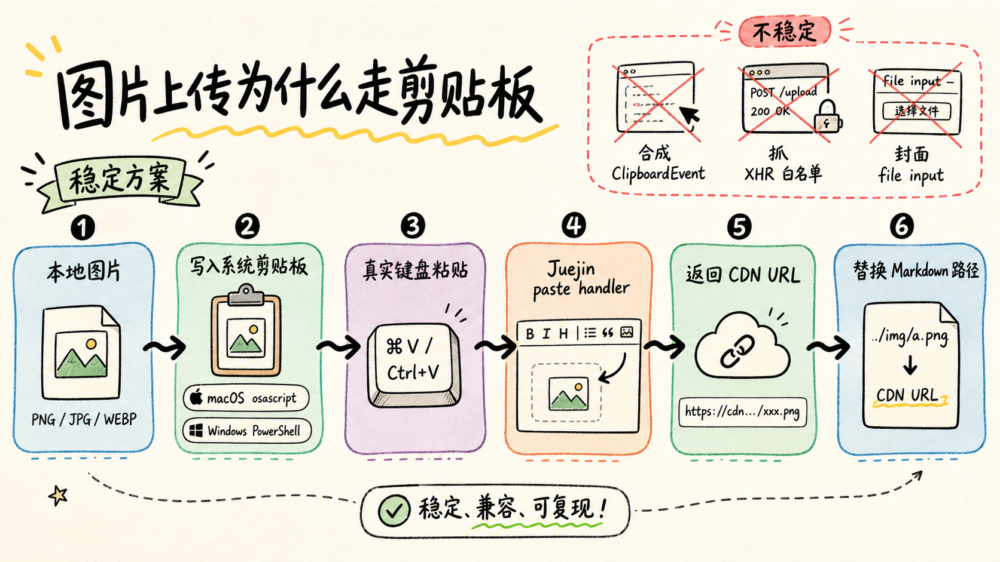

# 使用 markdown-post-skill 自动发布掘金文章教程

> 本教程展示如何用 [`markdown-post-skill`](https://github.com/JianJang2017/jianjang-skills/tree/master/markdown-post-skill) 把本地 Markdown 文章（含图片）一键发布到掘金草稿箱，**核心亮点是本地图片自动上传到掘金 CDN**。

## 一、这个技能能做什么

当你有一篇本地 Markdown 文章，里面可能包含 `` 这样的本地图片路径时，`markdown-post-skill` 帮你：

1. **自动打开掘金编辑器**（复用你已登录的浏览器 cookie）
2. **把本地图片上传到掘金 CDN**，并把 markdown 里的路径替换成 CDN URL
3. **写入标题和正文**
4. **预填分类、标签、封面、摘要**（从 frontmatter 读取）
5. **默认存草稿**——脚本完成后把草稿链接给你，由你在浏览器里最终核对并点发布

**图片上传方案**：掘金新版编辑器**没有工具栏上传按钮**，必须走剪贴板粘贴。脚本模拟真实用户操作——把图片写进系统剪贴板（macOS 用 `osascript`，Windows 用 PowerShell）然后发 `⌘V` / `Ctrl+V` 真实键盘事件，掘金的 paste handler 会触发上传并返回 CDN URL。



---

## 二、环境准备

### 1. 安装依赖

```bash
cd /Users/CXR499XQ66/Documents/workspaces/workspace_vibe/jianjang-skills/markdown-post-skill

# 安装 Python 依赖
pip install -r scripts/requirements.txt

# 安装 Playwright 浏览器（Chromium）
playwright install chromium
```

### 2. 浏览器登录方式（重要）

脚本有两种接入 Chrome 的方式，**自动回落**：

#### 方式 A：持久化独立 profile（推荐，默认）

**什么都不做**，直接跑脚本。它会用 Playwright 自带的 chromium + 独立 profile（`~/.markdown-post-skill/chrome-profile`），**首次会弹出浏览器让你登录掘金**，cookie 落盘后长期复用。

这是推荐方式，因为 **Chrome 136+ 安全限制禁止对主 profile 启用远程调试**。

#### 方式 B：CDP 接入已登录 Chrome（可选）

如果你想让脚本接入你**当前正在用的 Chrome**（省一次登录），需要：

1. 用 `--remote-debugging-port=9222` 启动 Chrome：

   ```bash
   # macOS
   /Applications/Google\ Chrome.app/Contents/MacOS/Google\ Chrome \
     --remote-debugging-port=9222 \
     --user-data-dir="$HOME/Library/Application Support/Google/Chrome"
   ```

   ```powershell
   # Windows PowerShell
   & 'C:\Program Files\Google\Chrome\Application\chrome.exe' `
     --remote-debugging-port=9222 `
     --user-data-dir="$env:LOCALAPPDATA\Google\Chrome\User Data"
   ```

2. 在这个 Chrome 里登录掘金（`https://juejin.cn`）

> **注意**：Chrome 136+ 即使用上述命令启动，端口可能不监听（安全限制）。脚本会自动检测连不上时回落到方式 A。

---

## 三、准备你的 Markdown 文章

### frontmatter 格式

在 markdown 文件顶部加 YAML frontmatter：

```yaml
---
title: 在 Spring Boot 里用 RocketMQ 做事务消息
category: 后端
column: 后端深水区
tags: [Java, Spring Boot, RocketMQ, 微服务]
cover: ./cover.png
summary: 用 RocketMQ 4.5+ 的事务消息特性串联本地事务和下游消费。
---

# 正文开始...
```

**字段说明**：

- `title`：**必填**，文章标题
- `category`：掘金一级分类（后端/前端/Android/iOS/人工智能/开发工具/代码人生/阅读），脚本会模糊匹配
- `column`：专栏名（可选）
- `tags`：标签数组，**必须是掘金已有的预设标签**，脚本不会自创（掘金不允许）
- `cover`：封面图，可以是本地路径（如 `./cover.png`）或 CDN URL，本地的会先上传
- `summary`：文章摘要（可选）

### 本地图片引用

正文里可以直接用相对路径引用图片：

```markdown


```

脚本会：

1. 把 `./images/architecture.png` 先上传到掘金 CDN，拿到 `https://p3-juejin.byteimg.com/tos-cn-i-xxx.image`
2. 把 markdown 里的路径替换成 CDN URL
3. 再把整篇正文写入编辑器

**支持的图片格式**：PNG、JPG、GIF、WEBP（macOS 下非 PNG 会先转 PNG，Windows 下直接支持常见格式）

---

## 四、一键发布

### 存草稿（推荐）

```bash
cd /Users/CXR499XQ66/Documents/workspaces/workspace_vibe/jianjang-skills/markdown-post-skill

python3 scripts/publish_juejin.py /path/to/your/article.md
```

**输出示例**：

```json
{
  "platform": "juejin",
  "draft_url": "https://juejin.cn/editor/drafts/7345678901234567890",
  "article_url": null,
  "title": "在 Spring Boot 里用 RocketMQ 做事务消息",
  "images_uploaded": 3,
  "images_total": 3,
  "status": "draft",
  "notes": []
}
```

脚本完成后：

1. 复制 `draft_url` 在浏览器打开
2. 核对标题、正文、图片、分类、标签、封面
3. 手动点「发布」

### 直接发布（跳过草稿）

```bash
python3 scripts/publish_juejin.py /path/to/your/article.md --publish
```

加 `--publish` 参数后，脚本会：

1. 上传图片 + 写入正文（同上）
2. 自动点「发布」按钮，打开发布弹窗
3. 填分类、标签、封面、摘要
4. 点「确认发布」

> **慎用**：发布是单向操作，删了重发会丢评论/点赞。建议先用草稿模式核对一次。



### 其他参数

```bash
# 临时覆盖 frontmatter 里的标题
python3 scripts/publish_juejin.py article.md --title "新标题"

# 指定 CDP 地址（默认 localhost:9222）
python3 scripts/publish_juejin.py article.md --cdp-url http://localhost:9223

# 更新已有草稿（传草稿 ID）
python3 scripts/publish_juejin.py article.md --draft-id 7345678901234567890
```

---

## 五、图片上传原理（技术细节）

### 为什么要走系统剪贴板

掘金新版编辑器（基于 CodeMirror 6 + bytemd）**没有工具栏上传按钮**，只接受 paste/drop 事件。常见的「自动化工具点按钮 → 找 hidden input → `set_input_files`」这条路在掘金新版**完全不存在**。

尝试过的失败方案：

| 方法 | 失败原因 |
|---|---|
| 合成 `ClipboardEvent` 并派发 | `clipboardData` 是 readonly，合成事件带不动真实 File |
| 抓 XHR response 白名单过滤 | 掘金 CDN host 多变，抓不到 |
| 用封面图的 file input | 上传的是封面，不是正文图 |

### 稳定方案：模拟真实用户粘贴

脚本的做法：

1. **写系统剪贴板**：
   - **macOS**：`osascript -e 'set the clipboard to (read (POSIX file "x.png") as «class PNGf»)'`
     - `«class PNGf»` 只认 PNG，非 PNG 先用 `sips -s format png` 转
   - **Windows**：`powershell.exe -Sta -EncodedCommand <base64>` 调用 `System.Windows.Forms.Clipboard.SetImage`
     - 必须 STA 线程（`-Sta`）
     - 直接支持 PNG/JPG/GIF/BMP/TIFF
2. **focus 编辑器**：`page.locator('.cm-editor').click()`，`⌘/Ctrl+End` 移光标到文末
3. **发真实键盘事件**：`page.keyboard.press("Meta+v")`（macOS）/ `"Control+v"`（Windows）
4. **轮询编辑器 markdown**：读 CodeMirror 内容，diff 出新插入的 `` 里的 URL

这样做的好处：

- **稳定**：走掘金自己的 paste handler 和上传管道，和人类操作完全一致
- **跨平台**：macOS / Windows 都实测跑通（Linux 暂未实现剪贴板分支）
- **零依赖**：不需要任何第三方图片上传库



### 验证剪贴板是否写入成功

如果图片上传失败（30s 内编辑器没出现新 URL），先验证剪贴板：

```bash
# macOS
osascript -e 'clipboard info'
# 应该输出包含 «class PNGf» 的列表

# Windows PowerShell
Add-Type -AssemblyName System.Windows.Forms
[System.Windows.Forms.Clipboard]::ContainsImage()
# 应该返回 True
```

---

## 六、常见问题排查


### 1. 脚本启动后无输出、卡住

**原因**：上一次脚本中断留下的 chromium 进程占着 `SingletonLock`

**解决**：

```bash
# macOS / Linux
pkill -9 -f ms-playwright && rm -f ~/.markdown-post-skill/chrome-profile/Singleton*
```

```powershell
# Windows PowerShell
Get-Process | Where-Object {$_.Path -like '*ms-playwright*'} | Stop-Process -Force
Remove-Item "$env:USERPROFILE\.markdown-post-skill\chrome-profile\Singleton*" -Force -ErrorAction SilentlyContinue
```

### 2. 提示"掘金未登录"

**原因**：持久化 profile 里的 cookie 失效，或首次运行还没登录

**解决**：

- 脚本会自动打开浏览器，在浏览器里登录掘金（扫码或密码）
- 登录后重跑脚本即可

### 3. 图片上传失败（images_uploaded < images_total）

可能原因：

| 错误信号 | 原因 | 解决方案 |
|---|---|---|
| 30s 内没出现新 URL | paste 没生效 | 检查剪贴板（见上节）；确认编辑器 focus 成功 |
| 401/403 | cookie 失效 | 在浏览器刷新 juejin.cn 主页重新激活 session 后重跑 |
| 413 / size too large | 单图超 5MB | 压缩图片后重试 |
| 图片文件不存在 | 路径写错 | 检查 markdown 里的相对路径是否正确 |

### 4. 分类/标签没匹配上

**stderr 会告警**：

```
⚠️ 分类 'XXX' 没匹配到掘金预设
⚠️ 标签 'XXX' 不在掘金预设里
```

**原因**：

- 分类：frontmatter 写错，或掘金改了分类名
- 标签：掘金不允许普通用户自创标签，只能从预设列表选

**解决**：

- 修改 frontmatter 里的 `category` / `tags`，改成掘金现有的
- 或在浏览器里手动选择

**掘金一级分类**（截至 2026 年中）：后端 / 前端 / Android / iOS / 人工智能 / 开发工具 / 代码人生 / 阅读

### 5. CDP 连不上，自动回落到持久化 profile

**日志**：

```
CDP 不可用（Connection refused），改用持久化 profile 模式
```

**这是正常现象**，不是错误。Chrome 136+ 禁止对主 profile 启用远程调试，脚本会无缝回落到独立 profile，首次需要登录一次。

---

## 七、配置文件（可选）

如果需要自定义 CDP 地址、默认分类、超时等，可以复制 `.env.example` 为 `.env`：

```bash
cd /Users/CXR499XQ66/Documents/workspaces/workspace_vibe/jianjang-skills/markdown-post-skill
cp .env.example .env
```

编辑 `.env`：

```ini
# CDP 地址（连不上时自动回落）
CDP_URL=http://localhost:9222

# frontmatter 没写 category 时的默认分类
JUEJIN_DEFAULT_CATEGORY=后端

# 单步超时（毫秒），网络差可调大
JUEJIN_TIMEOUT_MS=30000
```

**所有字段都是可选的**，不配也能用。

---

## 八、完整示例

### 文章文件：`my-article.md`

```markdown
---
title: 深入理解 Spring Boot 自动配置原理
category: 后端
tags: [Java, Spring Boot, 源码分析]
cover: ./cover.jpg
summary: 从 @EnableAutoConfiguration 注解入手，分析 Spring Boot 如何实现零配置启动。
---

# 一、什么是自动配置

Spring Boot 的核心特性之一就是自动配置（Auto-configuration）...


## 二、@EnableAutoConfiguration 注解

从这个注解入手，我们可以看到...


```

### 发布命令

```bash
# 存草稿（推荐）
python3 scripts/publish_juejin.py my-article.md

# 直接发布
python3 scripts/publish_juejin.py my-article.md --publish
```

### 输出结果

```json
{
  "platform": "juejin",
  "draft_url": "https://juejin.cn/editor/drafts/7345678901234567890",
  "article_url": null,
  "title": "深入理解 Spring Boot 自动配置原理",
  "images_uploaded": 3,
  "images_total": 3,
  "status": "draft",
  "notes": [
    "封面图已上传: https://p3-juejin.byteimg.com/tos-cn-i-xxx/cover.webp",
    "正文图片 ./images/boot-flow.png 已上传: https://p6-juejin.byteimg.com/tos-cn-i-xxx/flow.webp",
    "正文图片 ./images/class-diagram.png 已上传: https://p9-juejin.byteimg.com/tos-cn-i-xxx/diagram.webp"
  ]
}
```

打开 `draft_url`，核对无误后点发布即可。

---

## 九、设计哲学

### 为什么默认存草稿，不直接发布？

1. **发布是单向操作**：删了重发会丢评论、点赞、收藏
2. **让人最后核对一次**：分类、标签、封面、摘要，机器填的不一定完全符合你的意图
3. **安全优先**：脚本出 bug 时，最多草稿箱里多一篇草稿，不会污染你的公开文章列表

要直接发布，显式加 `--publish` —— 这是有意提高门槛。

### 为什么不自动登录？

账号安全是底线，尤其对于内容平台。脚本依赖用户**已登录的浏览器**，检测到未登录时直接停下，不会自动打开登录页或代填密码。

---

## 十、平台支持

| 操作系统 | 状态 |
|---|---|
| macOS | ✅ 实测跑通 |
| Windows 10/11 | ✅ 实测跑通（剪贴板走 PowerShell） |
| Linux | ⚠️ 浏览器接入可用，但图片上传的剪贴板分支未实现 |

Linux 用户如需图片上传，可参考 `xclip` / `wl-copy` 自行实现 `scripts/_common.py` 里的剪贴板分支。

---

## 十一、进阶：批量发布

如果有多篇文章要发，可以写个简单的 shell 脚本：

```bash
#!/bin/bash
SKILL_DIR="/Users/CXR499XQ66/Documents/workspaces/workspace_vibe/jianjang-skills/markdown-post-skill"

for md in ./articles/*.md; do
  echo "正在发布: $md"
  python3 "$SKILL_DIR/scripts/publish_juejin.py" "$md"
  echo "---"
done
```

每篇都会存草稿，你在浏览器里逐个核对后点发布。

---

## 十二、总结

[`markdown-post-skill`](https://github.com/JianJang2017/jianjang-skills/tree/master/markdown-post-skill) 解决了两个核心痛点：

1. **登录态复用**：接入已登录 Chrome，不用每次重新扫码
2. **本地图片上传**：把 `` 自动传到掘金 CDN 并替换链接

**推荐工作流**：

1. 写文章时用本地图片，不用管 CDN
2. 写完后 `python3 scripts/publish_juejin.py article.md` 一键存草稿
3. 打开返回的 `draft_url`，核对一次，点发布

**技能地址**：https://github.com/JianJang2017/jianjang-skills/tree/master/markdown-post-skill

---

## 附录：参考文件

- [README.md](https://github.com/JianJang2017/jianjang-skills/blob/master/markdown-post-skill/README.md) — 快速开始
- [SKILL.md](https://github.com/JianJang2017/jianjang-skills/blob/master/markdown-post-skill/SKILL.md) — 完整设计文档
- [references/juejin.md](https://github.com/JianJang2017/jianjang-skills/blob/master/markdown-post-skill/references/juejin.md) — 掘金选择器、典型报错、排查方案
- [.env.example](https://github.com/JianJang2017/jianjang-skills/blob/master/markdown-post-skill/.env.example) — 配置文件模板

有问题查 `references/juejin.md`，里面记录了所有走过的弯路和排查方案。
